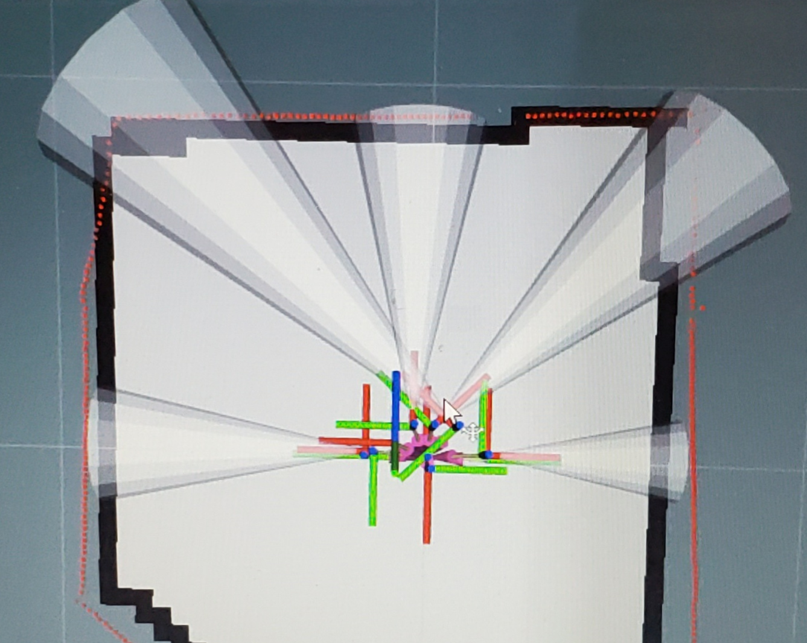

# Navigate Using A Lidar for Localization

#### &uarr;[top]( https://ubiquityrobotics.github.io/learn/)

<!-- todo This is one of the ways in which a robot's position in the `world` (localization) can
be determined.  For a discussion of other approaches, see the
[Navigation and Localization Overview](../overview/overview.md).
-->

This document discusses running our navigation software on a Ubiquity
Robotics robot base, using an RPLidar that would have to be installed you yourself. It also assumes that you have a workstation with ROS installed, which is connected to a network in common with the robot. You will need a printer, too.

Because navigation using a Lidar is a very popular and relatively easy mode for robots we are going to supply here some basic starter launch files and some directions for how to get started in robot navigation using a Lidar.

Our goal here is to put in one place the key elements of robot navigation using a very popular device, a LIDAR, to allow the robot to see walls all around and both map and then later navigate within a known mapped area.  We will use a RPLidar simply because they are easily available and a ROS driver exists for that Lidar.  

The full system here could be studied and investigated by learning more about such things as ROS /tf topic and the lidar itself as well as how ROS understands the orientation of sensors in 3D space. Plenty to learn but this is a known starting point as an example.


# The RPLidar In This Demo On The Magni

We will use a relatively low cost and very popular Slamtec RPLidar A1 that is connected to the Magni raspberry pi USB and will by default in most cases show up as serial device /dev/ttyUSB0.  If you have a Pi4 we recommend using one of the jacks with blue plastic as they have higher current capability.  Use a good quality USB cable to avoid loss of power in many of the cheap cables leading to odd problems.

For the launch files in this demos the RPLidar is screwed to the top plate using 5mm spacers so the ribbon cable can bend around and allow their little USB board to be connected via USB cable to a port of the Raspberry Pi.

The center of the lidar is centered in Y and is thus half way between each wheel but of course on top of the Magni top plate. The motor and pully is on the rear side of the lidar.


To modify this example for use of any other Lidar it would be best done after you understand this demo but even reading this demo set of instructions will offer you many things to investigate and research to go as far as you like with your own robot hardware.  Should you wish to use a different Lidar the launch files would need modifications and you would need a ROS driver for that Lidar.  

The position of the Lidar should match in X and Y as defined in the launch files by ```lidar_translation```   If you cannot place the lidar where it is shown here then you should adjust the X and Y values relative to what you see in this picture in the launch files.  I strongly suggest you not rotate the lidar unless you really must so try to have the large rotating lidar wheel towards the front as in picture.

There are 6 floating point values in the lidar_translation definition. First 3 are X,Y,Z translation in meters from our 'base_link' or a spot in space located directly between the centers of our two large main drive wheels. Z is not too critical so standoff height is not important because the lidar only generates data in the 2D X-Y plane. The next 3 values are rotational values in radians around the X,Y,Z axis.  If you must rotate the lidar about Z then note that the 6th value is the rotation about the Z axis (straight up). If you must rotate the lidar about X or Y ... you are on your own, it can be confusing.

# ROS Configuration And Prerequisites To Run These demo launch files

Unless we later install these on our images at this time, late 2020, these installs are required.

    sudo apt update
    sudo apt install ros-kinetic-navigation
    sudo apt install ros-kinetic-slam-gmapping

After the above installs to be prepaired to run navigation code you will also need the driver for the SlamTec RPLidar. There is a bug in how they setup the /scan topic ROS publisher so the ROS parameter of scan_topic_name does not work at the time of this writing, Oct 2020. So I have edited the hard coded string they use as seen below before the make.

    cd ~/catkin_ws/src
    git clone https://github.com/sharp-rmf/rplidar_ros
    cd ~/catkin_ws
    vi ~/catkin_ws/src/rp_lidar_ros/src/node.cpp
    Edit to replace ```scan_topic_name``` with ```scan``` where ros::Publisher_scan_pub is setup
    catkin_make

# A How To Get Our Demo Launch Files

You will need to update your ~/catkin_ws/src/demos  repository in order to get the launch files.  The command below will pull the new magni_lidar folder into catkin_ws/src/demos folder by doing a pull for your existing demo folder below.  The actual location of the magni_lidar demo on github is :  https://github.com/UbiquityRobotics/demos/tree/master/magni_lidar

    cd ~/catkin_ws/src/demos
    git pull
    cd ~/catkin_ws
    catkin_make -j 1

After the above steps you will need to decide on a physical location for the lidar and this location will have to be placed into the launch files below. We are trying to keep things simple but there are ways in ros to have parameter files and so on and perhaps those may be added.

For each launch file below open it up in an editor and be sure to make proper modifications as stated in the start of the launch file comments

# Making A Map Of Your Area

It is suggested on first time use of this demo to choose a fairly simple room without a lot of chairs and tables with thin legs at the height of the lidar.  It is also suggested until you understand this entire demo that you have a few things in your room so it is not just a complete square with no features.   The robot later will try to understand where it is so if you put it in a totally square room there are multiple choices and some situations may confuse the robot navigation stack.

Place the magni where you would like to be the origin of the map which will be X,Y as 0,0.  The easiest way to operate later when you use the map is to know where the front wheels are as you start your map and what direction the robot is facing so I suggest 2 pieces of masking tape to the sides of the wheels to use later.  Now you should totally restart the robot right at this origin which is done using a ```sudo shutdown -h now``` and then a full power off and power back on. The reason for this is that this is a certain way to set the MCB odom counters at 0,0 so when the magni-base service starts odometry will be reset.

After a couple minutes you will run the launch file example to start a lidar, the RPLIDAR A1, and make the system ready for gmapping is in this repository.

    roslaunch magni_lidar magni_lidar_mapmaker.launch

# Verify that the Lidar is Publishing To a ROS topic

Once the lidar is started, the /scan ROS topic will publish the lidar scan data. You can verify it is generating data (although it is a great deal of data) using this test command

    rostopic echo /scan

Use Control-C to stop this onslaught of text! we just wanted to see if the Lidar is running

We now want to clear any old ROS global map so a fresh one is generated next. We will form that folder if it does not exist and then remove or rename the map.txt file in that folder if the folder did exist already.  

    cd ~
    mkdir -p ~/.ros/slam
    mv ~/.ros/slam/map.txt ~/.ros/slam/map.old

## Running gmapping Once The Launch File Starts

On the laptop copy over lidar_mapmaker.rviz from this repository to your home directory so it can configure rviz easily. Then on the laptop you can run this from home folder.

    rosrun rviz rviz -d lidar_mapmaker.rviz

## Drive Around To Create A Suitable Map

Might be best to have a Joystick but if not you have to ssh to the robot and use 'twist' to drive around. You would then drive around the area with the optional Logitech F710 joystick or 'twist' command below but perhaps start

rosrun teleop_twist_keyboard teleop_twist_keyboard.py
As the robot drives. you will be building more date for the map and you would see it on RVIZ

Your best chance at a good map is to drive slowly.   So use the ```z``` key if using teleop_twist_keyboard so you set the speed down to around 0.2 or even less.   Never pick up and manually move the robot while making a map.  The robot must know where it's wheels are and see the Lidar as it moves around.   Sometimes I stop the robot every meter or so and let it get a clean set of lidar scans then move to another location.   Your goal is to drive around any objects so the Lidar sees all sides of all objects in the room.

Later you can do this whole map exercise in more complex rooms but keep it simple if you have never done this sort of thing before.

# SAVE THE MAP!

It is very important to ```SAVE THE MAP``` because if you just stop things you loose the entire set of data you just created with some effort I might add.

    rosrun map_server map_saver -f mynewmap-ils

We suggest you move both the .pgm and the .yaml files into magni_lidar/maps so they can be found and used easily

# Navigating Within A Pre-Created Map

Once a map is available you can then navigate within that map or set of rooms. This is that you have been waiting for frankly! The idea here is the launch file publishes onto ROS the previously made map and then you either drive around using only robot odometry OR you use some very advanced software called AMCL or Adaptive Monte Carlo Locationization figures out where the robot is at any given time. Both methods will be shown in this section.

A key piece of software used in this simple example is the move_basic package that will accept commands to go places and talk to the robot navigation stack to drive the robot to the destination. The move_basic package is unique to Ubiquity Robotics and is a simplified version for just point to point movements based on the more advanced move_base concepts. The ROS move_base package does path planning as well as object avoidance if the system has been setup for detection of things like a person or object getting in the way of the robot.

You then can use RViz on your laptop (described in mapping example) and can define a pose that you want the robot to move to. A 'Pose' means a specific location in terms of X and Y on the floor as well as the rotation of the robot.
Lets GO!

# Start The Navigation Stack Using An Existing Map

Here we need to start the launch file and specify a map that will be used for navigation in whatever room or area you are in that has previously been mapped using gmapping and saved as a map. Edit magni_lidar_maprunner.launch to set the desired map. We supply a tinyroom.map as an example but this is just a small square area and unless you duplicate it exactly this will not work for you. It was about 1.9M x 1.5M if you have a bunch of cardboard you could start doing navigation without the making of the map part of this demo

    roslaunch magni_lidar magni_lidar_maprunner.launch  

This launch file will strictly respect the odom information the robot keeps track of to determine robot position and rotation (called robot pose). The problem with this method is all robot odom only determination of pose drifts over time the more movements that take place. So this method is ok for a short demo but not very usable in general real world situations.

# Start move_basic So That You Can Set Goals And Navigate

So far we have setup things so the robot knows where it is within a map. We need to start some software that we can tell where we want to move to so that that piece of software can control the robot to approach a desired destination X,Y and rotation (both of these things together are called a desired pose. We will use rviz but we must start this piece of software called move_base now. Ubiquity Robotics move_basic is a simplified version of move_base where move_base can do complex plans to get around objects or corners. The move_basic package can only do line of sight straight paths and if something gets in the way it stops and does not plan around the object.

    roslaunch magni_nav move_basic.launch

We will now be ready to accept 'goals' and then move to those goals.

The more general solution to navigation uses object avoidance and the move_base package combined with a map that holds obstacles seen by sensors such as the sonar. The objects that move in fron are in what is called the costmap. Perhaps that will be added to this example in the future.

# Run RViz On Your Laptop To Watch And Set Goals

On the laptop copy over lidar_mapmaker.rviz from this repository to your home directory so it can configure rviz easily. Then on the laptop you can run this from home folder.

rosrun rviz rviz -d lidar_mapmaker.rviz

Below is an example of a very simple map shown in RViz.  The black outline surrounds gray 'known open area' and is the navigation stack's thinking on where the map ends or objects were located.    The red outline is the realtime lidar scan data.  The cones are shown here but we are not taking advantage of them so far in this demo.   The cones are data from the Magni Silver sonar board.  The colorful lines are different axis of different key parts of the robot and where they are located.   This picture does not have the simulated model of the Magni showing up because I like to see ALL the axis of the robot and you can even see the ones for the wheels rotate when the robot drives!



# Tell The Robot Where It Is Located In The MAP

The AMCL package is now told just where the robot is within the map and which direction it is pointing. This step allows the AMCL package to have a very good initial pose for the robot so it can estimate how to get to other locations right away.

Set the 2D Pose Estimate using the RViz interface as follows:

    - Left click the ```2D Pose Estimate``` button in RViz
    - Find the place the robot is in the map and left click on that spot but HOLD MOUSE BUTTON
    - A large green arrow will appear and you have to drag mouse so the arrow points the same angle as the robot is facing.
    - Release the mouse button and then the robot will have a very good estimate of it's pose

# Define A Target Pose As A Goal So The Robot Will Go There

Here is the really fun part, assuming all the other things are working. This is where you tell the robot to move to places in the map. Because we are using the simple move_basic planner be sure the path is clear to the destination.

The 'pose' of a floor based robot is both it's X and Y location as well as the rotation on the floor. That is what you will define.

I will attempt to explain in words how to define a goal for the robot. Basically we want to form a 2D Goal for the robot that is at some location and indicates the direction we want the robot to be facing when the goal is reached

    - Identify a place you want the robot to drive to
    - Click on the left mouse button on that spot and HOLD MOUSE KEY DOWN because an arrow will show up
    - Move around the mouse so the arrow points in the direction the robot will face when done
    - Release the left mouse button

If the gods are with you the robot will approach that spot and rotate to the direction you specified.

# Running AMCL to Dynamically Correct The Robot Location

The most common package that figures out where the robot it in the room (relative to the map made before) is called AMCL. It uses an adaptive Monte Carlo method to find the location of the robot at any given time.

Run the launch file below to use AMCL. To use AMCL in any real world situation which may have a complex map you first have to use RViz to tell the robot where it is in the map.

    roslaunch magni_lidar magni_lidar_maprunner_amcl.launch  

More things have to be all working nicely for reasonable results using AMCL so we suggest you get the odom only running first and only after that works move on to this example using AMCL.

The AMCL package figures out the map to odom transform and publishes that which in effect corrects the errors that build up on all robot self posting of odom frame. The earlier launch file had a static transform that published that the map to odom transform was 'zero' from map to odom frames. This launch file removes that static transform and lets the AMCL package publish the map to odom transform or tf.

# Where to Go From Here Using move_base instead of move_basic

This demo uses move_basic which cannot plan to move around objects or avoid objects that show up as the robot is navigating to a new pose (location).

We are not using the more powerful move_base in this example (so far) to keep things as simple as possible. If you choose to use move_base the planing is much more advanced but of course more things can then go wrong.

We hope to enhance this discussion of navigation by showing how to use move_base  as time permits us to add to what is here now.  What is presented here now is at least a good first start for people to get their feet wet then later dig in to the more complex but far more capable move_base doing true path planning around corners and around dynamically moving objects that were not in the map when it was made.

ROS navigation stack can use detection of things that get in the way of the robot or were not present at the time of map making to then alter the plan to follows a path the robot was taking to the destination.  Sensors such as sonar sensors can be used to detect things and place them in something called a costmap. The costmap can change as things move into and out of the path of the robot like your dog or cat or even somebody walking by or the movement of some object in front of the robot.

The move_base code can dynamically re-plan the path to be taken to avoid objects in the costmap.
