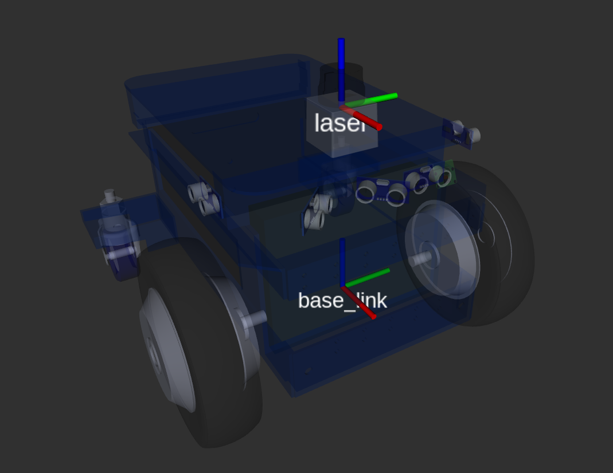

# Setting up ubiquity robotics default lidar

#### &uarr;[top]( https://ubiquityrobotics.github.io/learn/)

In this document it is described how to set up the LS-N301 lidar on the Magni.

# Mounting the lidar

**Before doing anything with the electronics, the robot must be powered down and THE BATTERIES DISCONNECTED.**

Connect the lidar lan cable into Raspberry Pi lan port and the power supply connector into the right molex connector on the MCB board: 

Using 4xM3 screws, the lidar can be mounted on the top plate that comes with Magni robot

<!-- TODO image -->

Now the batteries can be reconnected and the robot powered on.
## Default location

The default location of the lidar is on the top plate looking into the forward direction (lidar connector is turned backward). Top plate of newer robots comes ready with holes for lidar mounting. But some of the older versions don't have those holes. In that case please either contact Ubiquity Robotics to supply you with a new top plate OR use double sided tape to mount the lidar. If you chose to mount the lidar with the double sided tape please make sure its 1.) turned exactly forward - a slight offset in angle can result in inaccurate localization and 2.) its center is EXACTLY the position shown on the picture.

On the picture red, green, blue correspond to x, y and z axis

# Advanced: Changing LIDAR internal IP settings
**Warning: IPs are changed from their defaults, it is highly likely nothing will work out of the box with Ubiquity Robotics products.**

If buying a lidar from Ubiquity Robotics, the lidar will come pre-set with the IPs that were used in these tutorials:
 - LIDAR IP: **192.168.42.222**
 - IP to which lidar is connected (workstation IP): **192.168.42.125**

If you want to change those lidar-internal IPs [here](https://workdrive.zohoexternal.com/external/af682a9813143dc25804ba5ba415776213005cdf5fdd94ef796800ca6ba3132f) is a video about how to do that.

Additionally to whats shown on the video, make sure:

1. First make sure you have WinPcap installed (sourced [here](https://workdrive.zohoexternal.com/external/4b6aefb568cd674dfd5b0fa846535897202c93a31b5de5bad275020bc7c29560) or download from the internet)
2. Follow the steps shown on the video to change the LIDAR IP, but a couple of notes:
 	- by default the PC IP should be 192.168.1.125. If this is the same subnet as the other interfaces (eg. WiFi) this may cause problems. In this case disconnect from any other connection but the LIDAR to get it working :)
 	- in the video the IP is changed to 192.168.42.125 -> this is arbitrary and can be any IP

# Next steps
If your base image is running Ubuntu Focal and ROS Noetic follow tutorial: [Setting up magni-default lidar Noetic](/learn/doing_more/ls_lidar_setup_noetic.md)

If your base image is running Ubuntu Xenial and ROS Kinetic follow tutorial: [Setting up magni-default lidar Kinetic](ls_lidar_setup_kinetic.md)