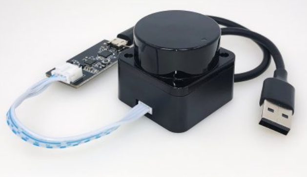
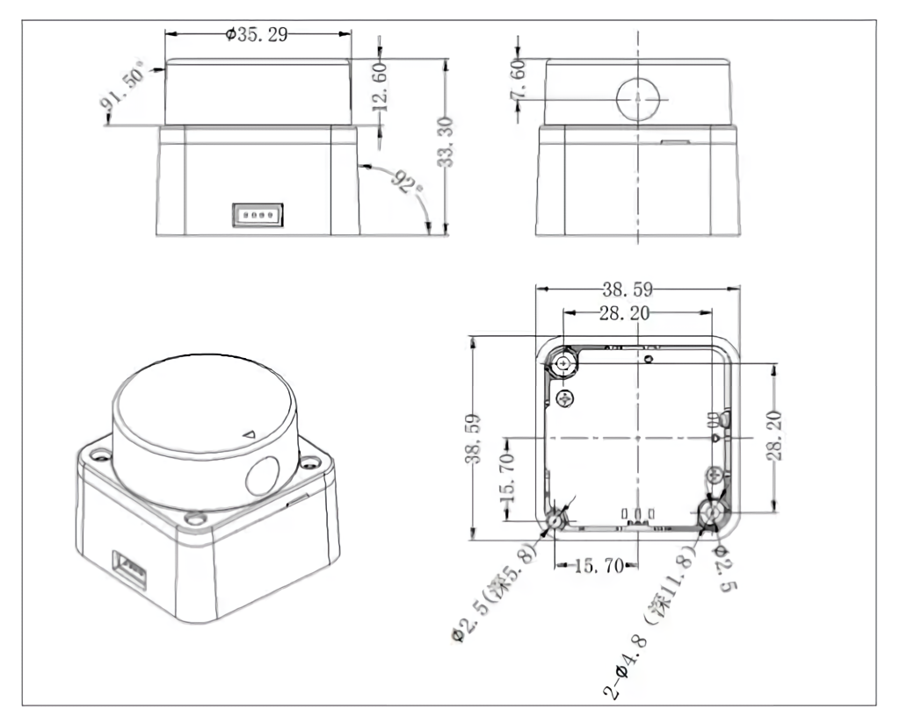

---
title: "UR-12 Short Range LiDAR"
permalink: kinetic_ur12_lidar
rosver: kinetic
nav_exclude: true
--- 

# UR-12 Short Range LiDAR

| ----------- | ----------- |
| Range      | 12 m       |
| Cabling   | USB-to-Serial        |
| Based on  | LDRobot LD-06        |
| Input power voltage      | 4.5V-5.5V (USB)       |
| Scan frequency      | 5-13Hz      |
| Min detection distance | 0.02m |
| Max detection distance | 5-12m  |
| Scan angle | 360 degree |
| Ranging method | TOF flight time ranging |
| SKU | SRL00001 |

<H4 style="color:red">When changing out sensors makes sure to disconnect the RED battery cable from the batteries and wait 2 minutes so high voltage and current are not linked with the main board!</H4>

## Installation

Plug the USB cable (on the picture above) into any of the Raspberry Pi USB port (NOT the MCB ones, those only provide power) and the lidar should turn on automatically when the Pi boots. 

On raspberry Pi:

    cd ~/catkin_ws/src/
    git clone https://github.com/UbiquityRobotics/ur12_lidar.git
    cd ..
    rosdep install --from-paths src --ignore-src -r -y
    catkin_make
    source devel/setup.bash 
    
Make sure that lidar launch reflects the device name that the ld06 lidar is registered under and then:
    
    roslaunch ld06_lidar ld06.launch
