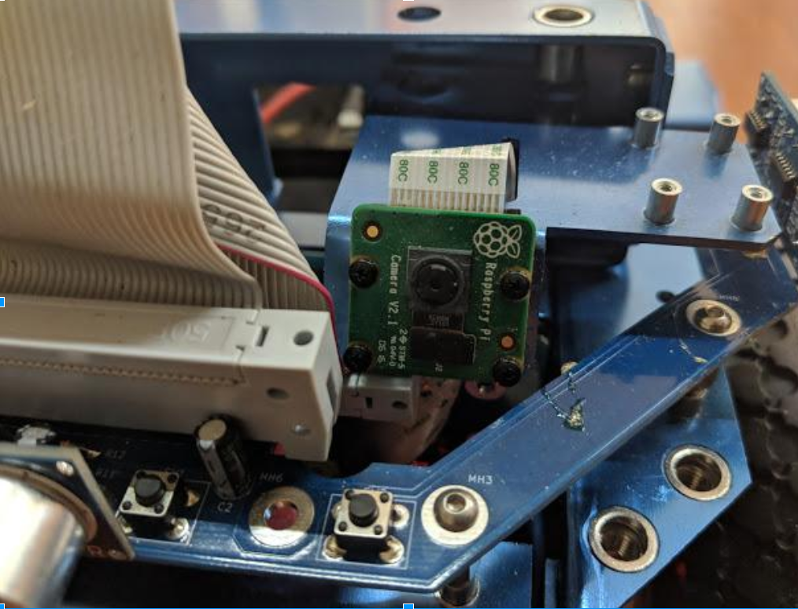
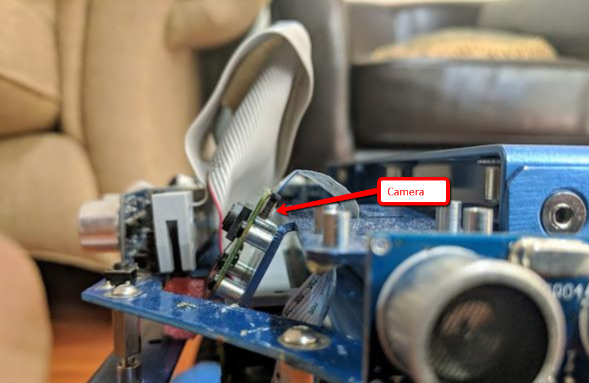

#### &uarr;[top](https://ubiquityrobotics.github.io/learn/)

# Troubleshooting
### The Battery

The quickest test: With Robot Commander connected to the robot,
say "battery".  You should get a reasonable percentage answer.  Also, the battery
command should appear in the Command Log window.

Make sure your battery is installed correctly, with all the contacts
fully attached and the batteries are fully charged.
A pair of fully charged Lead Acid batteries should give around
26-27V - if you don’t have a voltmeter the robot can self report
battery voltage which is covered later on in this message (point 5).
A good way to make sure the batteries are fully charged is by
plugging in the provided charger. If it switches off automatically
then the the batteries are fully charged.

Make sure that both push buttons on the front of the robot are out
all the way (one of the push buttons de-energizes the motor circuit
as an emergency stop). Both blue and red LED on the PCB that has the
switches should be illuminated.

Check the 5 LEDs on the master control board
(the big PCB on the robot)
that you can see on the front of the robot right above the switch
PCB. All 5 should be illuminated. The top one should
blink briefly every 6 seconds. If you don’t see this behavior then
email contact@ubiquityrobotics.com.

Check the fuses on the robot - you should be able to visually
see if the fuse is blown.

SSH in to the robot. Type

    rostopic list

This will list all the available topics on the robot one of
which will be /battery_state or similar then type

    rostopic echo /battery_state

it will give you a bunch of diagnostic information about the
battery state. Confirm that the battery voltage is at least
above 25V. This is also a good way to confirm that you are
getting correct communication between the raspberry pi main
computer and the master control board.

### Robot Commander

#### Connecting

In the following we assume that RC is connected to the robot.  By voice, after connecting, command
"battery".  You should get a response indicating the battery charge state. Now you know that the connection works.

#### Operation

Open a window on your workstation and ssh into the robot. Type

    rostopic list

This will list all the available topics on the robot, one of
which will be /cmd_vel.  If it doesn't, the trouble must be in the robot. Then type

    rostopic echo /cmd_vel

Any new messages on the /cmd_vel topic will now be shown on the screen.

Now tap the forward arrow on the RC screen.  You should immediately see
something like the following on the workstation screen:

    linear:
      x: 0.2
      y: 0.0
      z: 0.0

If you do, the command is getting from RC to the robot, and if the robot does
not move, there is a fault in the robot. In this case, ssh in to the robot in a
second window. In the robot try teleop by typing

    rosrun teleop_twist_keyboard telelop_twist_keyboard.py

once this is running you should be able to drive the robot
forward by typing the “I” key.  Again you will see the command echoed in the
first window.  If the robot does not move it is clear that there is a fault in
the robot alone.

If you do not see the command echoed, note the command log on the RC screen.
If the command is not logged there, RC has not understood the command
and issued it.  If the command is logged and you know that the connection
works, then the RC has tried to transmit the command. The problem may be with RC, with
the connection between the phone and the robot or with the phone or with the network.

Sometimes if an Android phone is connected to a data plan then the
phone will try to direct packets from robot-commander to the
internet rather than the robot. It may help to switch off
your external data plan before trying to make robot commander work.

### Fiducial Follow
1) Check that the fiducial is the correct size; the thick dark square that is the exterior of the dark parts of the fiducial should be exactly 14.0 cm along each edge.

2) Make sure that there is a white border around the big black box of the fiducial. The camera must see white around the black square--a 2 cm border is recommended. Our fiducial system generates pages correctly by default and has cut symbols on it that are workable.  

3) Make sure the module is flat against the PCB of the camera board and hasn’t been damaged - it should look like this:

4) Make sure the camera is mounted at the correct location and that it is correctly oriented.

Note: Please ignore the connection to the sonar board - this type of connection is particular to our engineering robots only

5) Check that you have a charged button battery in the CR2032 battery holder on the back of the robot

Now we check the various pieces of software are correct

6) Make sure you have the latest software by typing

    `sudo apt update; sudo apt upgrade`

Then run it again to verify that everything got upgraded correctly

    `sudo reboot`

7) Now we check the robot model.

run `rostopic echo /tf_static`. The output should be similar to the following (though formatted differently).

transforms:  
  -  
  header:  
      seq: 0  
      stamp:  
        secs: 1535314942  
        nsecs: 653950257  
      frame_id: "base_link"  
    child_frame_id: "base_footprint"  
    transform:  
      translation:  
        x: 0.0  
        y: 0.0  
        z: -0.1  
      rotation:  
        x: 0.0  
        y: 0.0  
        z: 0.0  
        w: 1.0
  -
    header:  
      seq: 0  
      stamp:  
        secs: 1535314941  
        nsecs: 653983009  
      frame_id: "base_link"  
    child_frame_id: "raspicam"  
    transform:  
      translation:  
        x: 0.035  
        y: 0.085  
        z: 0.14  
      rotation:  
        x: 0.385136504193  
        y: 0.385099407014  
        z: 0.593001082056  
        w: 0.593058206701

8) Launch the fiducial navigation software

9) Launch rviz

check the following features  
a)  
b)  
c)  
d)  
e)   
f)  
g)  

10) Run htop to verify that there isn't anything that is taking up large numbers of CPU cycles or memory that isn't ROS related.

11) Camera calibration is not usually necessary as we provide a default camera calibration file that should work in most cases. However, even in mass produced cameras of the same type, there is always some camera to camera variation, that can only be eliminated through careful calibration. If there is aberrant behavior and all other sources of problems have been eliminated, or if you simply want the best possible accuracy and performance from your system then do camera calibration. A tutorial for camera calibration can be found at: https://github.com/UbiquityRobotics/raspicam_node/#calibration

12) If all of that is correct you should be able to see fiducials as desired and it should all work.
