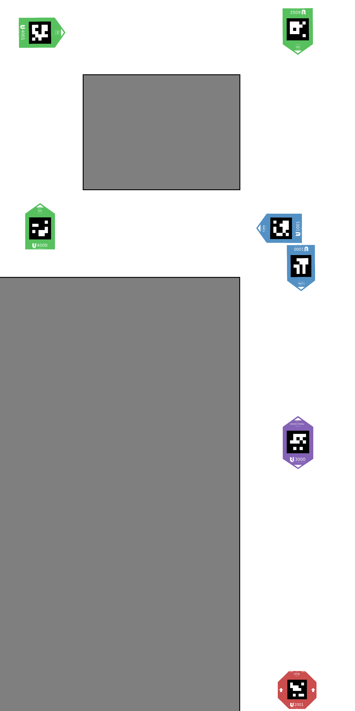
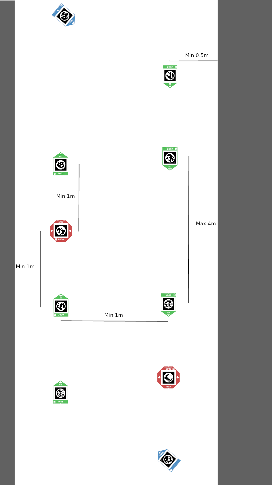
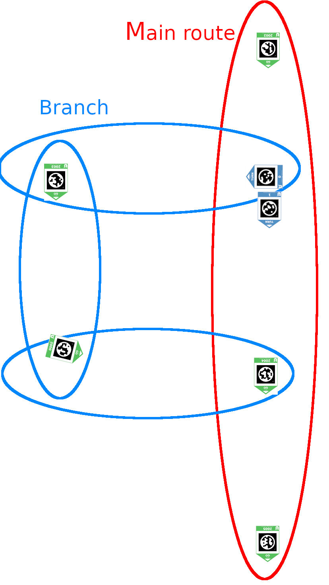
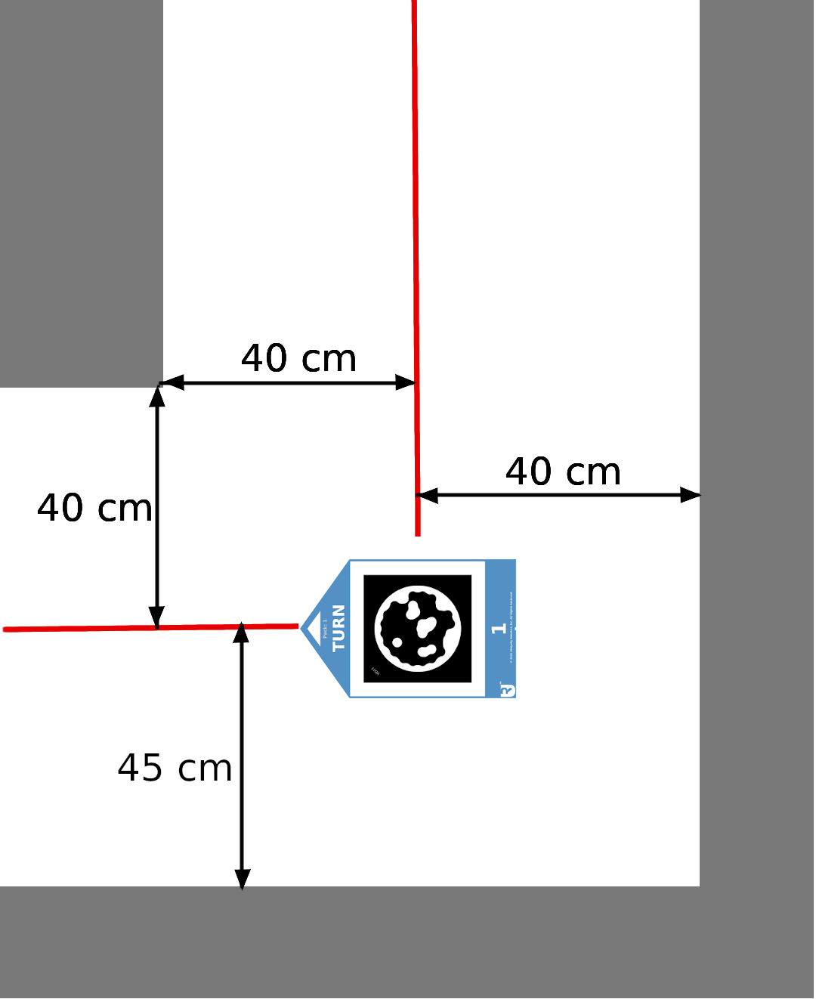
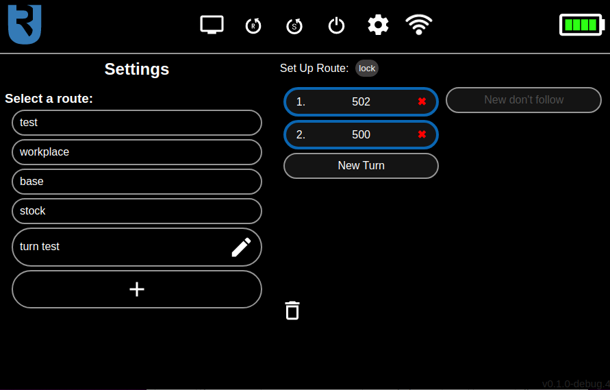

# Route Setup

To set up a route, first place [fiducial markers](noetic_conveyorbot_fiducials) in desired locations, then use the touchscreen to specify which turn markers each robot should follow. 

Read the [usage guide](noetic_conveyorbot_usage) section first to understand how routes work.

**Note that this page is a work in progress, and some parts might be outdated. If you are unsure about some details, contact Ubiquity Robotics support.**

## How to place floor markers

To ensure your setup works as intended, follow these rules to prevent undesired behavior:

- Each marker should accurately point towards the next one.
- Markers shouldn't be too close together (crossroads are exceptions).
- Before permanently sticking markers to the ground using their strong adhesive back side, use tape to test your route setup. Don't cover the inner black part of the marker with tape. Once the route is set up correctly, stick the markers to a clean, smooth floor.
- Route loops should be configured so that robots turn only left or right depending on where the lidar is mounted. This prevents "T-shaped" collisions and simplifies robot interactions. Currently, place the lidar in "shell left" position and set up routes for left turns (robot drives counter-clockwise from a bird's-eye view). This limitation will be removed soon, allowing for route setups in both directions.
- Use TURN markers  to create crossroads (or switches, in railroad terms).
- Use GO markers  for one-way routes, where the robot can drive only towards the next marker.
- STOP markers  make the robot stop and turn to continue, so ensure it's possible to continue the route in the direction of the arrow.
- Use BIDIRECTIONAL markers  for two-way routes, where the robot can drive in both directions while driving straight (e.g., to and from a contact charger). Robots should never approach BIDIRECTIONAL markers from the side, as it's unclear which way they should turn. If you expect more than one robot on a route, have separate outbound and return paths; otherwise, robots may meet head to head, causing both to stop. Use BIDIRECTIONAL markers on branches where only one robot is expected to be present at a time.

An example of a simple marker layout is shown below.

### Ignored opposite markers

By default, opposite-facing GO markers are ignored. This ensures that outbound and return paths work correctly when they're close together.

### Circuit route

For multiple robots driving on the same marker setup, arrange the markers in a "circuit route" to prevent collisions. This setup is recommended even for one robot, as you might add more robots later. Circuit routes are divided into inbound (path for robots to drive to the goal) and outbound (path for robots to return to the starting point) paths. Place the paths a little more than 1 robot width apart (about 20 cm more) to avoid collisions. If you have space, place the routes 1 meter apart. Arrange markers at both ends of the path as shown below, and consider the measurements from the image.

Circuit routes include one "main circular route" that can be seen as "main inbound and outbound paths" or just as a circular route. You can set it up in an inbound-outbound style where the paths are close together, or as a big "looping route" that "ends where it begins" with "inbound and outbound paths" far apart. The style of the "main circular route" depends on your specific use case.

To include a STOP marker in the circuit route, place it one meter behind the GO marker. GO markers must be a maximum of 4-5 meters apart, regardless of where you put the STOP markers. STOP markers are ignored if you don't want the robot to stop on them. On each end of the circuit route, there is a TURN marker, which you need to include in the route on the touchscreen. A GO marker won't work, as it would be ignored since it faces the opposite direction of the robot's driving direction.

### Branches from the main circuit route

You can also create "branches" from the main circular route, as shown below.

There's a possibility that two robots collide where the branch merges back into the main route. To handle this, the robot coming from the branch always "looks" left with LIDAR to see if there is another robot approaching from the main route. If so, the robot approaching from the branch will stop and wait for the robot on the main route to pass. This is the so-called "T-shaped collision avoidance".

However, this introduces a problem. Robots **always** look left when turning right on a marker to detect a potential robot on the main route. If the robot is just turning right (and not going back to the main route), there should ideally be about two meters of clearance on the left side to avoid detecting a wall or obstacle as an approaching robot. If not possible, disable T-collision detection for each individual marker that makes the robot turn right where you don't want it to stop due to an obstacle on the left. This can be done on the touchscreen's route settings screen by clicking on any marker in the route and checking the "Disable T collision check" checkbox. 

Keep in mind that rejoining the main route at a point where the main route makes a 90-degree turn creates problems with collision avoidance. Rejoin the main route a few decimeters earlier than where the main route takes a 90-degree turn (by placing a marker there and pointing the last marker on the branch towards it).

### Narrow hallway limitations

Minimum distances from the route to walls are presented below.

## Touchscreen UI

In this section, we will present the web application designed for the 7'' touchscreen monitor. Its primary function is to manage routes for the ConveyorBot. A menu bar is present at the top of all screens, offering functionalities such as rebooting the robot, monitoring battery percentage, navigating to the "Control Panel screen," and more. The map icon on the top right corner of the "Control Panel screen" leads to the "Route Settings screen," where routes can be set up.

### Control panel screen

The most noticeable part of the "Control Panel screen" is the large green "Start/Stop button" labeled "START." Pressing it changes its color to red and its text to "STOP." This button allows the robot to start or stop following the markers of the currently selected route. When the robot completes the route by stopping on a STOP marker, the button changes its color to blue and its text to "CONTINUE." Pressing the button now will make the robot start following the route again from the beginning.

The route can be easily selected in the dropdown menu located below the "Start/Stop button." To edit, create, or delete a route, press the gear icon in the top right corner to go to the "Settings screen." To reset the route (to start the route from the beginning), select another route and then the desired route again (there is currently no "reset route" button).

The Control Panel screen with route "turn test" selected is shown in the image below.

 

 

### Menu bar

The menu bar is present at the top of all screens. On its left side, there is a Ubiquity Robotics logo, which serves as a button that always leads to the "Control Panel screen." On the right side of the menu bar is a battery level indicator. When the battery falls below 40%, a low battery popup will appear. In this case, you should **stop using the robot and start charging it**. In the middle, there are several buttons, each with its own functionality. 

They are the following (from left to right):

1. A computer monitor button that leads to the "Debug screen" where users can monitor the camera's image stream and detected markers or move the robot with the software joystick.

2. An "R" in a circular arrow button that prompts the user to reboot the robot.

3. An "S" in a circular arrow button that prompts the user to reboot the robot's software. This is useful because it functions similarly to rebooting the robot but is faster.

4. An on/off symbol button that prompts the user to turn off the robot.

5. A sprocket button that leads the user to the "Debug Settings" screen. This screen contains additional settings for updating and recording ROS topics into a "bag file" used for debugging purposes.

6. A WiFi state indicator button that displays the WiFi status. If the robot is connected to the WiFi, the button shows a regular WiFi icon shape, indicating the WiFi strength. If the WiFi is disconnected, it shows the same shape but with a cross symbol drawn over it. If the WiFi is in hotspot mode, it has the shape of two regular WiFi icons rotated 90° to the left and right. Pressing this icon displays the WiFi info, including the IP address, SSID, and hostname. Here, you can also connect to a new WiFi access point by entering the SSID and password into the appropriate fields and clicking the "Connect to the new WiFi" button.

### Route settings screen

On the left side of this screen is a route selection section. To add a new route, press the "+" shaped button below all routes. When clicking on any of the displayed routes, the route editor will be displayed on the right side of the screen, where you can edit the selected route.

The route editor has two columns. In the left column, you can specify the markers to follow, and in the right column, you can specify the markers to ignore. You can also rearrange the specified markers by dragging and dropping them. To prevent accidentally rearranging the markers while scrolling up and down the list, you can disable the drag and drop functionality by clicking the "lock/unlock" button above the left column. The function of "markers to follow" and "markers to ignore" and instructions on how to correctly set up a route will be described in the next section.

To delete the currently edited route, click the button with the bin icon at the bottom of the screen.

The Route Settings screen is shown in the image below.

 

### Route management

Route management functionality enables the ConveyorBot robot to navigate in a more advanced way. As previously mentioned, the main route management page can be accessed by pressing the route settings button on the Control Panel screen.

##### Properly setting up a route

Think of the route setup process as having a navigator while driving a car. The navigator only tells you where to turn at crossroads but doesn't instruct you to continue straight on a straight road or to stop where there's already a stop sign. To set up a route for the robot, you need to specify only the sequence of TURN markers at the crossroads of the route. By default, all other TURN markers not specified in the route plan are ignored. You don't have to specify GO, STOP, or BIDIR markers, except in specific cases discussed later in this section.

To specify the order of turns at crossroads, add the numbers of TURN markers indicating the appropriate turns to the left column of the route editor in the correct order. In the left column of the route editor, you must also specify all STOP markers where you want the robot to stop. If you don't do this, the robot will ignore STOP markers by default.

To completely ignore a marker, add it to the right ("Don't follow") column. This might be useful, for example, if there is another independent marker setup nearby, and you want to ignore markers from the other setup.

##### Notes to keep in mind

When creating a route, ensure that the first marker is close enough for the robot to detect; otherwise, the robot won't start. You can check if the first marker is detected in the Debug screen; it should have a green outline on the camera image.

A special case where you must specify GO, STOP, and BIDIR markers in the route is when two markers from the same crossroad are in the route one after another. This can happen if the route goes from a crossroad to a STOP marker directed back to the same crossroad. In this case, you must specify this STOP marker in the marker list. In general, you must specify at least one marker on a route segment that goes out of a crossroad and then returns to the same crossroad. This is a current issue that will be addressed in future updates.

Please note that after making any changes to the route, it will automatically be resent to the robot and started from the beginning. Therefore, you should move the robot to the start of the route after making changes.