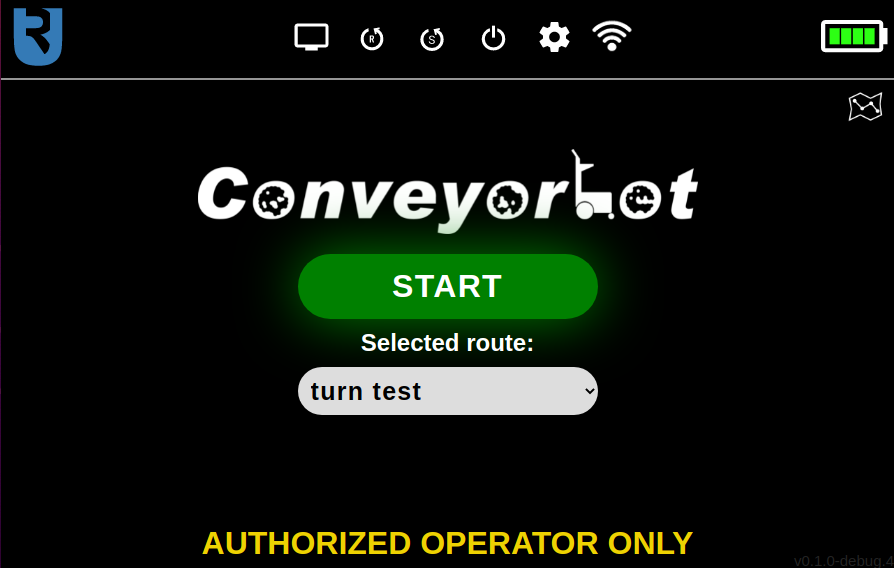

# Basic Usage

Before operating Conveyorbot, you need to [set up routes](noetic_conveyorbot_setup). If routes are already established and you want to run the robot on a specific route, this page contains the necessary information. It's also recommended that you read this page before setting up routes to understand the robot's basic operation.

## Turning Conveyorbot On and Off

On the robot's shell, slightly above its right wheel, you'll find a black power switch and a red emergency stop button. To start the robot, turn the power switch to the "on" position and wait for the boot process to finish. To shut down the robot, press the Power off button on the robot's touchscreen navigation bar and wait for the shutdown process to complete. After that, you can switch the power switch to the "off" position. In case of an emergency, press the emergency stop button to halt the robot (this won't turn off the robot). To resume movement, rotate the emergency stop button slightly to release it. 

**Be aware that the robot may not move if the emergency stop button is pressed accidentally. If this happens, release the button.**

## Starting the robot

When the robot boots up, the touchscreen display shows a **Loading screen**. Once the system is ready, a screen with a **START** button and a drop-down list for route selection will appear.

First, select a route, and the Conveyorbot will wait for you to press the START button. This will initiate movement on the chosen route. 

It's important that the robot initially detects a marker that's part of the selected route; otherwise, it won't move, and a warning will appear on the screen. To ensure the robot sees a specific marker, open the **Joystick control screen** with the monitor-shaped button in the navigation bar. On this screen, you'll see the robot's current view, with detected markers outlined in green. If the starting marker isn't in the camera's field of view, use the joystick on the right side of the screen to move the robot until the marker is visible. 

When starting from a green "GO" marker, the robot must be facing the same direction as the marker (oppositely directed GO markers are ignored by default). The robot should be on the other side of the GO marker (the side without the arrow) and facing toward the marker (with the marker in the camera's field of view). 

If starting from a purple "BIDIRECTIONAL" marker, note that the robot will begin moving in one of the two directions indicated by the marker's arrows - the direction requiring less robot rotation. [Here](noetic_conveyorbot_fiducials) is more information about each type of marker.

## Navigation and stopping

<video style="display: block; margin-left: auto; margin-right: auto;" width="75%" controls autoplay>
  <source src="assets/breadcrumb/Ubiquity_Turn_Cutted.mov" type="video/mp4">
  Your browser does not support the video tag.
</video>

 

Conveyorbot will smoothly navigate between markers, with each marker arrow pointing towards the next marker. Sometimes, a marker may point to a cluster of blue TURN markers (a crossroad), each pointing in a different direction. In this case, the robot will decide which of those markers to follow based on the selected route.

Equipped with advanced LiDAR-based collision avoidance software, Conveyorbot will stop if an obstacle or another robot is in its planned path, preventing collisions. The robot will automatically resume movement once the obstacle is cleared. This also allows multiple Conveyorbots to operate on the same "marker setup" simultaneously.

A "marker setup" typically refers to all markers that form the "main circular route" and any "branches" connected to it. For multiple robots to operate on the same marker setup, this structure of markers is recommended. Detailed information about this structure can be found in the Route Setup section, but in short, the "main circular route" (MCR) is a common "looping" route that is part of all possible routes on a specific marker setup. From the MCR, a "branch" can be created so that some robots can go to another part of the facility in which they operate (by following this branch) and then return to the MCR. Having multiple branches enables some robots to go to one part of the facility while others go to another part.

A branch can either have distinct "outbound" and "inbound" "marker paths" (each made of basic one-directional markers), or both outbound and inbound paths can be on the same "bidirectional" marker path, made of BIDIRECTIONAL markers. A "route" specifies the exact path the robot will take through these branches (which ones the robot will drive on). 

Note that **it is not possible for two Conveyorbots to drive simultaneously on a route that contains the same branch if that branch contains BIDIRECTIONAL markers**. This is because the robots might get stuck on such a branch if they meet head to head when one of them is driving in the inbound direction and the other in the outbound direction. Thus, only one robot can drive on each bidirectional branch at a time.

When the robot encounters a STOP marker (), it will stop on it and turn in the direction of the arrow. Once the robot is on a STOP marker, it will wait until the **CONTINUE** button is pressed on the touchscreen, and then proceed in the arrow's direction. It's also possible to specify a custom timeout for each individual STOP marker, after which the robot will automatically continue driving (to specify that timeout, refer to the [route setup page](noetic_conveyorbot_setup)). You can stop (pause) the robot at any time by clicking the red STOP button on the touchscreen and then resume it by clicking the green START button again.

<video style="display: block; margin-left: auto; margin-right: auto;" width="75%" controls autoplay>
  <source src="assets/breadcrumb/Ubiquity_Start_Stop.mov" type="video/mp4">
  Your browser does not support the video tag.
</video>

 

## Battery charging

In the route setup, a **charging marker** can be specified. This is a TURN marker on the main circular route (MCR) followed only when the robot's battery is low and needs charging. This marker directs the robot to a branch containing a STOP marker on which the robot always stops. In this way, a robot with a low battery doesn't obstruct other robots driving on the marker setup. A charger should be plugged into the robot(s) waiting on the charging branch. 

When the robot's battery is full, press the CONTINUE button, and the robot will re-enter the MCR and continue driving.

## Alternative manual navigation

The robot can also be driven using an optional [Logitech controller](noetic_quick_keyboard_driving#using-the-optional-logitech-controller) or through the touchscreen UI (with the software joystick on the **Joystick control screen** mentioned earlier).