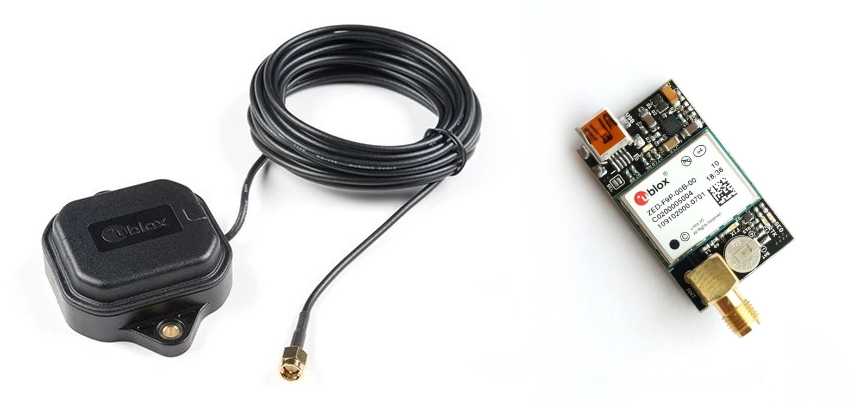
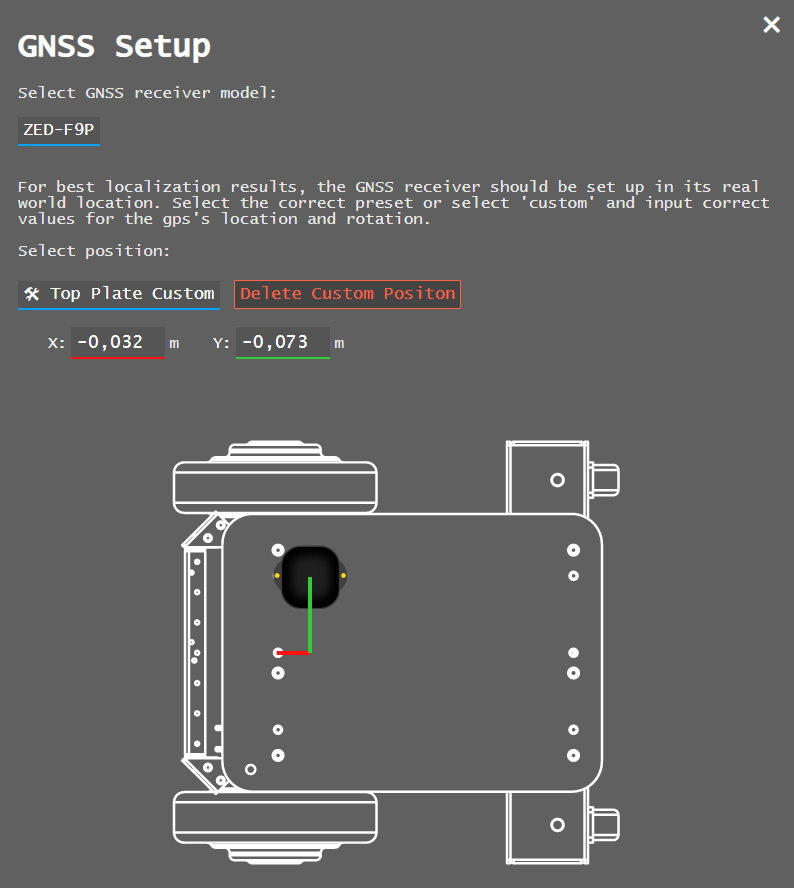

---
title: "RTK GPS"
permalink: noetic_magnisilver_gps
group: "magni silver (gen 5)"
rosver: noetic
nav_order: 8
nav_exclude: false
--- 
# RTK GPS

<H4 style="color:red">When changing out sensors, disconnect the RED battery cable and wait 2 minutes so no power is sent to the main board!</H4>

The picture below shows the ZED-F9P RTK GNSS module and antenna that are part of the plug-and-play satnav navigation stack in EZ-Map. The stack also requires installation of an [IMU](noetic_magnisilver_imu).

## Assembly

The antenna SMA connector (gold round connector) should be connected to the ZED module first, then the micro USB cable can be connected from the board to one of the Raspberry Pi's USB ports. Do not connect plug it into the MCB USB ports, those are for power only.

Until a standard housing is available, it's recommended to place the ZED module in a non-conductive box to prevent accidental shorts. 

## Enable in EZ-Map

To enable the satnav stack in EZ-Map, open the calibration menu () and select GNSS Setup. Here you can select the ZED-F9P sensor in the dropdown menu.
Once this is selected and the robot rebooted, the system will switch from lidar-based to gnss-based mapping.

Since there's no standard position to mount the sensor yet, you'll have to decide on the location that works best for your robot and input it into the interface. The general guidelines for good results are to have the antenna lay flat with full view of the sky, if there are other objects mounted on the robot it should be mounted above them to reduce occlusion. Mounting with double sided tape is a good option for testing different locations.

