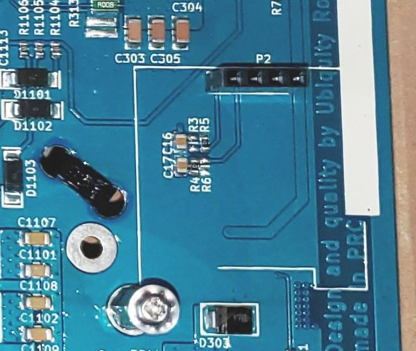
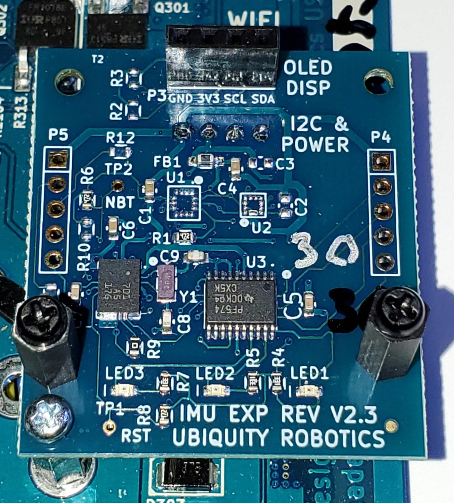
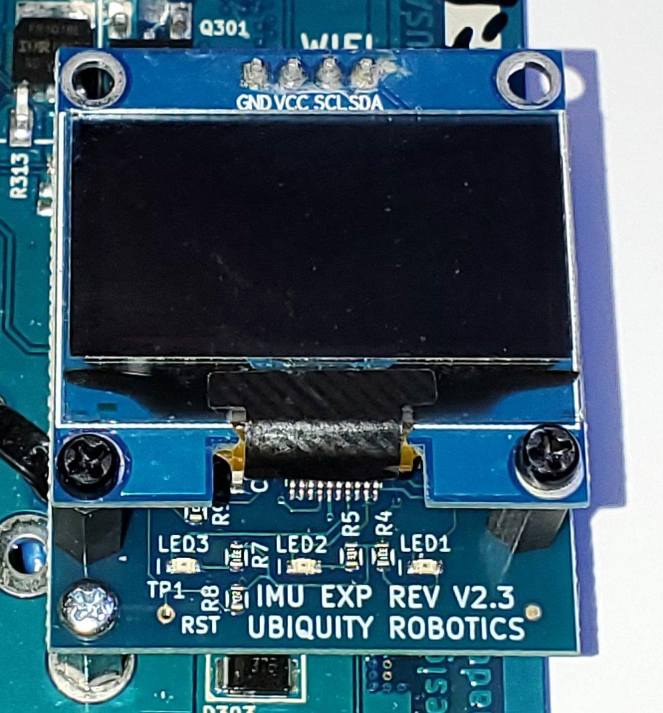

---
title: "IMU"
permalink: noetic_magnisilver_imu
group: "magni silver (gen 5)"
rosver: noetic
nav_order: 9
nav_exclude: false
--- 
# Inertial Measurement Unit (IMU)

<H4 style="color:red">When changing out sensors, disconnect the RED battery cable and wait 2 minutes so no power is sent to the main board!</H4>

This document describes how to install the Ubiquity Robotics ‘IMU EXP’ board which is designed for an expansion board to offer Accel/Gyro/Magnetometer as well as extra LEDs and IO capability for the Magni MCB (Main Control Board). This doc is for the Rev V2.3 IMU EXP board.

This process can be done with the MCB installed in the Magni Robot. Proper consideration of anti-static handling should be done, ideally with a static wrist strap connected to the Magni center pins of the large white power connectors on top of the board which are grounds. You can also always touch the MCB ground prior to your next step of the process as a 90% solution to avoid damage.

Verify before starting that the main MCB board is version 5.2 or later version. **Rev 5.2 or later MCB boards are required to support the power needs of this IMU board. The version of the rev 5.2 and later boards is in bold white silkscreen on the left side of the MCB board as you look at the front of a Magni.**

**Remove The OLED display if it is present on the MCB by unscrewing the one screw and lifting out the oled display board.  Save this screw for attachment of the IMU board.**

The pictures in this document show the area on the far right lower side of the MCB.  The OLED display now ships standard as of late 2021 on ALL mcb boards of rev 5.3 or later.

If your board has the OLED display then unscrew the screw that holds the board lower left corner to a standoff on the MCB.  Then pull out the OLED display board and set it aside.  Save the screw and washer.

If your board does not have a display simply remove the screw and washer seen in the following picture in lower left.  Save that screw and washer.

The board will then look like the picture below where nothing is inserted into the 4-pin P2 jack.  Some MCB boards do not have the OLED display so the MCB will look like the picture below from the very start of this process.

|Empty 4 pin port        |
|:-------------------------:|
||


## Install the IMU board

Next locate the IMU board that will have installed on the back a 4-pin connector.  Orient the board so the pins can be inserted into the P2 jack and insert the pins into the P2 jack.  Take care to be sure all 4 pins go into the P2 jack and are not off by one or more pins.

| IMU Board Installed        |
|:-------------------------:|
||

Use the screw and washer from the original MCB and secure the IMU board to the MCB as shown above using the far lower left hole in the IMU board.

There are 2 sets of black nylon standoffs that are mounted in the front left and right holes  in the picture.  Each is a M2.5 12mm high hex nylon standoff with female thread at top and a 5mm threaded post at bottom goes through board and an M2.5 nut on bottom.  A 6mm separate black nylon screw with 4.5mm dia philips head is supplied for each post to hold the LED board.

## Install the OLED display on top

If you had an OLED display then insert the 4-pins on the back of the display into the jack on the IMU board with the label 'OLED DISP' and again be sure all 4 pins are inserted.

Notice the use of another M2.5 12mm standoff to secure the OLED display to the IMU Expander board below so all these boards have a firm anchor mechanically.

| IMU Board and OLED installed on top       |
|:-------------------------:|
||

Next use the small black screw that was in the IMU board metal standoff to attach the OLED display lower left hole to the IMU board metal standoff.

We now ship two nylon standoffs on the IMU board with nylon screws to not damage glass.

------------


## For Developers

Additional information that is only relevant to those working with the IMU directly.

To test out if the module works, refer to [the page for verification of I2C Bus Devices](http://localhost:4000/noetic_magni_silver_verification#part-2--basic-host-to-mcb-tests).

### Testing on the Raspberry Pi 

The board can run a test to read IMU data for Accel and Gyro while it cycles through the 3 leds some number of times specified by the `-e` parameter.  The `-a` `0x28` is default address on I2C
Easiest to test in rev 5.2 or later MCB board and  Raspberry Pi 4 with board plugged in.

To test board standalone on a Raspberry Pi 4 or later you are fine doing connections below.
Hook up the display 4 male pins out the back of the board to the Raspberry Pi 40 pin:

| Board     RaspPi   Comment on signal  |
| ----- | --------- |-------------------------- |
| GND   |   Pin 9 |      Raspberry Pi ground |
| 3V3   |    Pin 1 |      Raspberry Pi 3.3V pin |
| SCL   |    Pin 5  |     SCL1  this is the I2C Serial Clock  | 
| SDA   |    Pin 3 |      SDA1 this is the I2C Serial Data line |


To run the test be in the folder with the executable called  `getbno055`

```
./getbno055 -a 0x28 -e 12
```

The Full Source and a README for runtime test usage is in README.tests in the zip.  If you need to compile the test we assume you know your way around general C compilation on a linux system and we are not going to explain modifications to the test source here.

The Zip File with source and README is called `imu_expander_test.zip`

Contents of the `README.tests.txt` file:

```
Here are some IMU Expander board standalone tests:
This Doc Version: 30 May, 2022   mj@ubiquityrobotics.com

sudo systemctl stop magni-base     Stop magni

See All I2C devices on the bus:
sudo i2cdetect -y 1

Run the OLED display if main software not running
roslaunch oled_display_node display.launch

Test the BNO055 IMU board with Io Expander leds. Num tests is -e value
./imu/imu_expander_test/getbno055 -a 0x28 -e 12

Simple test of ADC/Dac IO Expander at I2C addr 0x21
sudo  i2cset -y 1 0x21 0xC0`       Set left led. `0x60` for right
sudo i2cget -y 0x21`
```

### A word about this IMU and IO Expander

This document is meant to be the hardware installation guide and as such does not contain very many technical details about software required to use the devices on the IMU IO Expander beyond the brief explanation below.

The board has a Bosch BNO055 9dof IMU which is at I2C address 0x28.  The usage of the BNO055 with our Raspberry Pi requires usage of a custom I2C driver that can support clock stretching or some measurements are corrupt. 

The board also has a PCF8574 8-bit IO port at the I2C bus address of 0x21.  This IO Expander has 8 slow speed digital lines brought out to jacks on the board.  3 of the IO lines, D5, D6, D7 drive leds that are visible in front of the robot.  The IO expander can drive signals low with enough current to drive leds however when used as inputs by first sending each input line a digital 1 the inputs use very weak pullup resistors and can only accept 0 – 3.3V.  Usage of input signals above 3.3V will damage the IO port.

There are other parts loading options on the board which are beyond the scope of this install guide to discuss except to say unloaded positions for the LSM6DS3 compatible accel/gyro chip by ST microcomputer as well as the LIS3MDLTR magnometer are designed into this board but not shipped.  Also on this board the ability to load some other SMT jumpers so that the BNO080 can be supported and programmed in the sysem are present but not loaded by default.


The software required to take advantage of this IMU board has been under development as of the last month of 2020 so that must be installed for this board to be actively used by the Magni.


### The IMU requires driver support for Clock Stretching 

This board is controlled by the Raspberry Pi over the I2C hardware bus.  The default I2C driver that talks to the IMU on the Raspberry Pi does not support what is called clock stretching and the BNO055 does require clock stretching support or from time to time the readings read back get garbled and the data can and will be extremely bad.  

When we have used this board for customers we use an Image that has enabled another driver for the Raspberry Pi version of Ubuntu Linux.  To use this driver as root edit /boot/config.txt
```
#Comment out the i2c_arm line so it reads   
#dtparam=i2c_arm=on

#Add near end this
dtoverlay=i2c-gpio,i2c_gpio_sda=2,i2c_gpio_scl=3,bus=1

#Reboot the robot using
sudo shutdown -r now
```
Verify new driver by after the reboot use    `dmesg | grep -i i2c`  to get following line  on next line
       `i2c-gpio 100000002.i2c: using lines 2 (SDA) and 3 (SCL)`

This driver uses more CPU so if you are doing very high rates of reading the IMU you will see a much higher CPU load on the Raspberry Pi than the default driver but no data corruption.

You can look for the I2C devices on the board using     `sudo i2cdetect -y 1`
The line that starts with 20: should have a 21 and a 28 on it for this board

