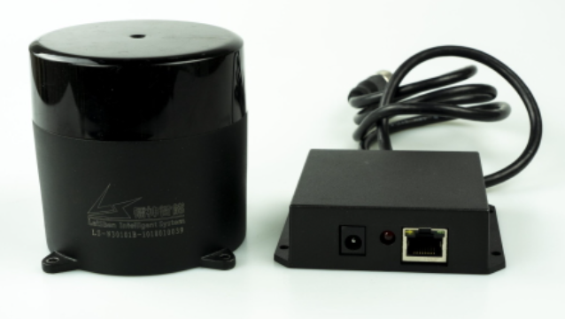
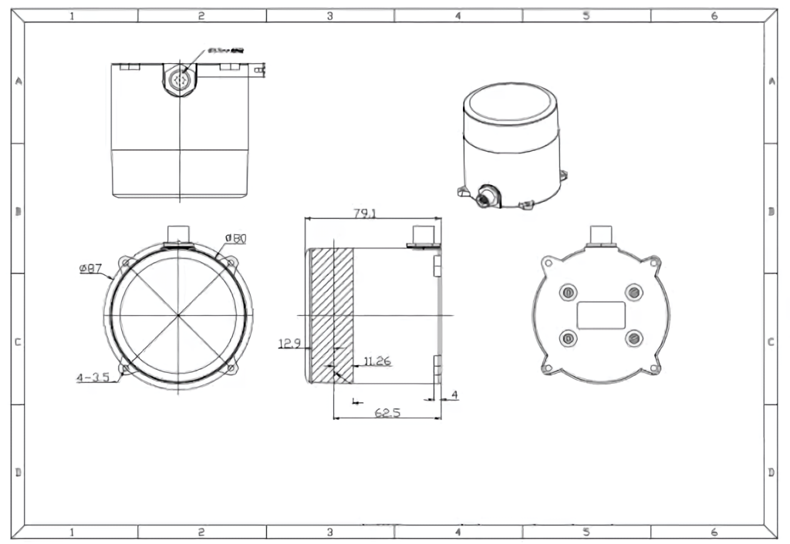
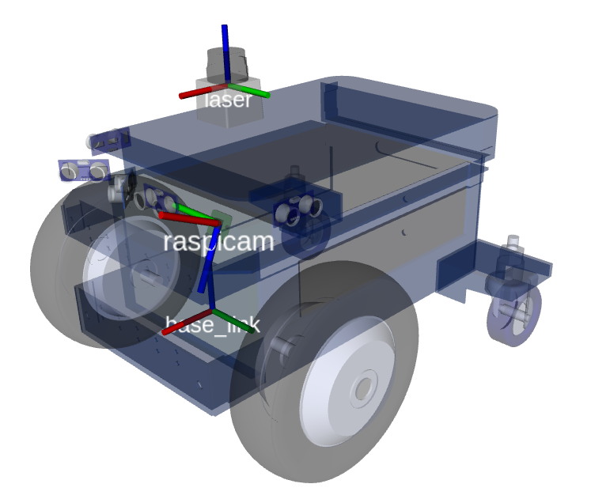

---
title: "UR-50 Long Range LiDAR"
permalink: noetic_ur50_lidar
rosver: noetic
nav_exclude: true
--- 

# UR-50 Long Range LiDAR

| ----------- | ----------- |
| Range      | 50 m       |
| Cabling   | Ethernet + AMP Power Plug       |
| Based on  | LeiShen N301        |
| Input power voltage | 12V       |
| Input power consumption | 6 W (500mA@12V) |
| Scan frequency | 20 Hz |
| Min detection distance | 0.05m |
| Max detection distance | 50m |
| Scan angle | 360 degree |
| Ranging method | TOF flight time ranging |
| SKU | LRL000001 |

<H4 style="color:red">When changing out sensors makes sure to disconnect the RED battery cable from the batteries and wait 2 minutes so high voltage and current are not linked with the main board!</H4>

**This tutorial is intended for magni_robot branch: [noetic-devel](https://github.com/UbiquityRobotics/magni_robot/tree/noetic-devel/)** and ROS Noetic.

## Installation

Connect the lidar lan cable into Raspberry Pi lan port and the power supply connector into the right molex connector on the MCB board: 

Using 4xM3 screws, the lidar can be mounted on the top plate that comes with Magni robot

<!-- TODO image -->

Now the batteries can be reconnected and the robot powered on.

If you're using a shell + tower setup, see the [shell assembly guide](noetic_quickstart_shell_tower#shell-assembly) on how to mount the lidar onto it.

### Default location

The default location of the lidar is on the top plate looking into the forward direction (lidar connector is turned backward). Top plate of newer robots comes ready with holes for lidar mounting. But some of the older versions don't have those holes. In that case please either contact Ubiquity Robotics to supply you with a new top plate OR use double sided tape to mount the lidar. If you chose to mount the lidar with the double sided tape please make sure its 1.) turned exactly forward - a slight offset in angle can result in inaccurate localization and 2.) its center is EXACTLY the position shown on the picture.

On the picture red, green, blue correspond to x, y and z axis. Lidar is the component that says 'laser' on the image (lidars are sometimes also called lasers)

## Advanced: Changing LIDAR internal IP settings
**Warning: IPs are changed from their defaults, it is highly likely nothing will work out of the box with Ubiquity Robotics products.**

If buying a lidar from Ubiquity Robotics, the lidar will come pre-set with the IPs that were used in these tutorials:
 - LIDAR IP: **192.168.42.222**
 - IP to which lidar is connected (workstation IP): **192.168.42.125**

If you want to change those lidar-internal IPs [here](https://workdrive.zohoexternal.com/external/af682a9813143dc25804ba5ba415776213005cdf5fdd94ef796800ca6ba3132f) is a video about how to do that.

Additionally to whats shown on the video, make sure:

1. First make sure you have WinPcap installed (sourced [here](https://workdrive.zohoexternal.com/external/4b6aefb568cd674dfd5b0fa846535897202c93a31b5de5bad275020bc7c29560) or download from the internet)
2. Follow the steps shown on the video to change the LIDAR IP, but a couple of notes:
    - in the video PC IP  is changed from 192.168.1.125 to 192.168.42.125. This was done because often external network is also on the subnet 192.168.1.xxx and this creates problems with the internet connection. 
    - in the video the IP is changed to 192.168.42.125 -> this is arbitrary and can be any IP

LiDAR UR50 network setup on Ubuntu 20.04
Ubuntu changed the way to set static IPs when they upgraded to 20.04. To assign a static IP using netplan create/edit the following:

/etc/systemd/network/10-eth-dhcp.network:

  [Match]
  Name=eth0

  [Link]
  RequiredForOnline=no

  [Network]
  ConfigureWithoutCarrier=true
  Address=192.168.42.125/24
/etc/netplan/01-netcfg.yaml (create it if not already present):

  network:
    version: 2
    renderer: networkd
    ethernets:
      eth0:
       dhcp4: no
       addresses: [192.168.42.125/24]
       gateway4: 0.0.0.0
       nameservers:
         addresses: [8.8.8.8]
Since netplan is being used we also need apply the changes:

   sudo netplan --debug apply
This will flag anyy errors in your file (yaml is space sensitive).
Check to see if things are correct with

ifconfig 
and ping to 192.168.42.222 to see if there is a successful transfer of packets:

ping 192.168.42.222
### Compiling

    cd ~/catkin_ws/src
    git clone https://github.com/UbiquityRobotics/ls_lidar_driver
    cd ~/catkin_ws/
    rosdep install --from-paths src --ignore-src -r -y
    catkin_make
    

### Running

    cd ~/catkin_ws/
    source devel/setup.bash
    roslaunch lslidar_n301_decoder lslidar_n301_config.launch device_IP:=192.168.42.222

### Default lidar extrinsics

The system is setup so that lidar extrinsics can be set in two places with following priorities:
    
1st priority in `~/.ros/extrinsics/lidar_extrinsics_<POSITION>.yaml`
    
2nd priority in package `magni_description/extrinsics/lidar_extrinsics_<POSITION>.yaml`

Where `<POSITION>` is taken from `~/.ros/ubiquity/robot.yaml`, parameter `lidar_position`.

Example: 

This means that if in `~/.ros/ubiquity/robot.yaml` the parameter `lidar_position` is set to `top_plate`, like it is by default ([see default robot.yaml settings](https://github.com/UbiquityRobotics/magni_robot/blob/noetic-devel/magni_bringup/config/default_robot.yaml)), the system will first search for `~/.ros/extrinsics/lidar_extrinsics_top_plate.yaml`. If that does not exists it will search for `magni_description/extrinsics/lidar_extrinsics_top_plate.yaml`. If none of those can be found the lidar extrinsics will not be loaded.

The difference between the two locations is that inside `~/.ros/extrinsics/` the extrinsics files will be robot-specific and will not be overwritten by git pulls or automatic updates - its meant for users to store custom extrinsics files. Where as `magni_description/extrinsics/` location will be overwriten with both git pulls and updates - its meant as a storage of widely used default extrinsics.

### Example: Adding a custom lidar location

You can mount the lidar in a custom location on the robot, but then you need to indicate the extrinsics (x, y, z, roll, pitch, yaw) of the custom location in robots configuration files. That can be easily done by:

1.) adding an additional extrinsics configuration into `~/.ros/extrinsics/lidar_extrinsics_<POSITION>.yaml`, where `<POSITION>` is an arbitrary name for the new configuration. Lets say a new lidar location with name "backward" must be added - lidar turned backwards. In this case we would:

    nano ~/.ros/extrinsics/lidar_extrinsics_backward.yaml

and into it insert the coordinates of the lidar turned by 180 degrees in yaw:

    ### This file must be formated in the following way
    #
    ### x: 0.0
    ### y: 0.0
    ### z: 0.0
    ### roll: 0.0
    ### pitch: 0.0
    ### yaw: 0.0
    #
    ### Otherwise you might experience "No such key" errors when running robot description urdfs

    x: 0.2
    y: 0.0
    z: 0.0
    roll: 0.0
    pitch: 0.0
    yaw: 3.14 #pi

2.) now the newly created extrinsic configuration `lidar_extrinsics_backward.yaml` must be set to be used the next time rpi boots:

    sudo nano /etc/ubiquity/robot.yaml

where the `lidar_position` must be set to "backward"

    lidar_position: 'backward' ### to disable insert "None"

Now raspberry pi can either be restarted OR the systemctl reloaded with:

    sudo systemctl restart magni-base.service

The lidar is now set at a custom location which can be seen in Rviz. To see all available extrinsics files both for camera and lidar please check directories `~/.ros/extrinsics/` (user specified custom extrinsics) and `~/catkin_ws/src/magni_robot/magni_description/extrinsics/` (system default extrinsics - will be overridden with every git update)
