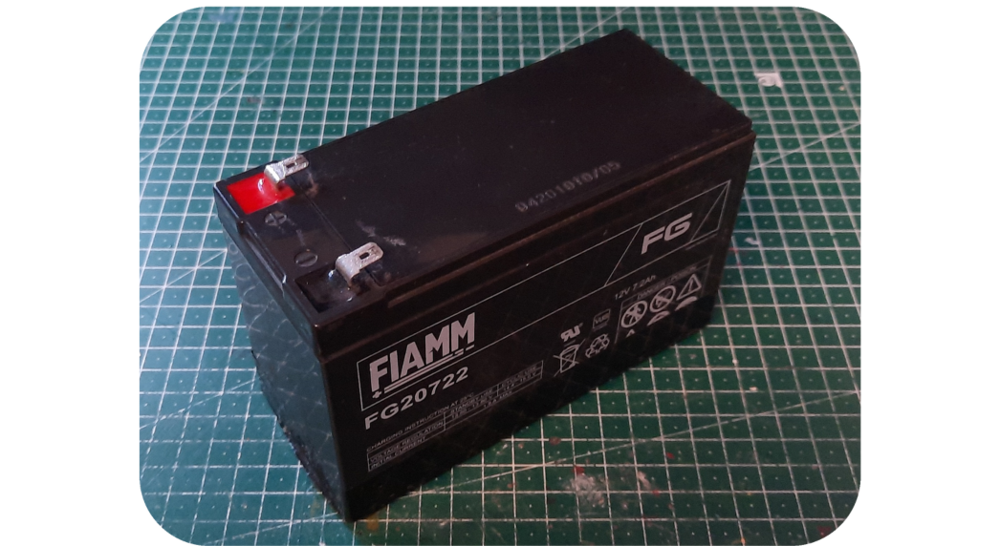

# Batteries

The robot ships by air worldwide. The batteries are not included in order to keep shipping costs down, as they are are difficult to ship worldwide and safety restrictions vary by destination. The recommended lead acid batteries are easy to source locally.

An added advantage of not including batteries is that the robot accepts different battery sizes so the user can select batteries depending on whether they prefer a long-endurance heavier robot or a short- endurance lighter robot. In short, you need to find your own batteries to put in the robot and these are commonly available online or in local stores that supply products for scooters, wheelchairs, uninterupped power supply systems or even automotive.

<H4 style="color:red">VOLTAGE CONNECTED TO THE MAIN CONTROL BOARD (MCB) MUST REMAIN 30.0V OR LESS AT ALL TIMES!</H4>

## Specific Qualified Lead Acid Batteries

The robot requires **two** **12V** lead acid style batteries wired up in series to provide 24 volts, and typically we recommend one of the choices in this section.

| Battery Size      | Capacity (Ah)  | Runtime (hours)  | Notes |
| ---------------- | ---------------- |---------------- |----- |
| 1250/1255  | 4 - 6      |      3 - 4		 |	Used when portability of the robot is at a premium - for example if you are travelling by air with the robot. |
| 1270  		  | 7 - 10    |   6 - 8  	 	 |	This size battery makes the robot still light enough to lift. |
| 12350  		  | 30 - 35     |   12 - 24  	 	 |	Recommended only for those who must have extraordinary endurance. This sized battery makes the robot sufficiently heavy that it will be difficult for most users to lift. |

A typical 1270 7.2Ah 12V battery, two of these are most commonly used with the Magni.

The stock battery charger we supply is ONLY FOR LEAD ACID batteries and will NOT work and in fact may be dangerous for other battery technologies.

While any set of batteries that can together supply roughly 24V will work, the ideal battery type is a deep cycle lead acid battery. Typically for the smaller batteries (1250, 1255, 1270) a gel type lead acid is common and for the larger types (12350) an AGM type is more common. Li battery types will work, but it should be a drop in replacement type that is fully compatible with a lead acid charging cycle and has its own battery balancing system (typically LiFePO4). As the system is designed for lead acid batteries if you use anything else the battery state topic could give misleading numbers as to the true battery state, but this will not affect the ability of the robot to drive properly.

## Compartment Size

We ship Magni with a foam cut-out that nicely holds two 1270 format Lead Acid batteries. **Do not discard the foam inserts along with the packaging.**

The floor of the battery compartment is always at least 205mm x 258mm.  Due to manufacturing tolerances it may be larger but that cannot be guaranteed.

From the floor to the top of the top rails on the side we have 135mm of height.  Batteries can go up taller to the top flat metal plate and that would be a height of 184mm.  These measurement are intentionally meant to avoid trying to get so close on a mm of clearance as our manufacturing cannot guarantee milimeter exact tolerances.

## Typical Current Draw

Below is a table showing typical currents seen on the positive lead of the battery using a DC clamp on meter for steady states.

|  Operating State | DC Current in Amps |
|-------------------------|----------------------|
|  Stationary robot using the Pi4 with 4GByte and on flat ground with motor power off | 0.4 - 0.45 |
|  Driving on flat surface with no load at about 0.5 meters/sec  |  0.8 - 0.9 |
|  Rotating in place with no load (about same as slow driving) | 0.8 |
|  Stationary on flat ground with power to the motors |  0.5 - 0.6 |
|  Stationary on flat surface but pushing down and back on robot so wheels have to fight to stay in one place but we are not slipping just yet | 1.2 |
|  Place the robot so it cannot move and apply a great deal of torque to each wheel so the motor controller has to fight to hold the wheels firm.  | 2 - 3 |

The instantaneous currents can be well over 10 amps in certain cases but since these are transient cases for stress tests they are not considered useful for battery life calculations.

Other cases such as the robot driving up a slope with large loads of course also increases current over the above values.

## Real-time clock (RTC)'s CR2032

There is also a CR2032 coin cell battery on the back of the [MCB](noetic_magnisilver_mcb).  This provides power to the real-time clock, which is **essential** for time keeping while the robot is without power or turned off. If this battery is not installed, obtain one and install it. Insert the battery with the lettering side up.

## Capacity and Aging

**Battery capacity is a complex topic so we try to tell users a percentage that is based on brand new fresh batteries, as the Magni has no idea the state of the batteries that are in use and their age and past usage patterns.**

All Lead Acid batteries lose their ability to hold a full charge over time and have a lower capacity after charging than a new battery and get to the full voltage that a new battery can attain as they age and have been through different levels of discharge and then re-charging cycles. The voltage curve should stay consistent thoughout so the percentage indicator should remain usable throughout their life span, however they may no longer ever register as 100% charged, as even the idle current draw sags the voltage more than on new batteries.

#### General guidelines for lead acid gell cells commly used on the Magni robots:

1. Do not let your robot run when it is under **50% capacity** which is around 24 V for the 2 magni batteries. Operating below that voltage level (2 V per cell) shortens the battery's charge capacity and lifespan due to sulfation. Shutting down the Raspberry Pi is not enough as it will continue to draw notable current while off, so the robot must be completely turned off using the MCB switches as well.

2. The MCB will **disconnect the battery** if the voltage drops below \~20 volts. This is a last resort to prevent complete loss of the batteries, as they should never reach this low level of charge and will be seriously damaged by it. Due to battery voltage sag during high current operation it's also not possible to disconnect sooner. This abrupt cutoff may cause Pi SD card corruption.

3. When used on old or damaged cells the robot's charger may cause slight overcharging if left connected after charge completion and **can cause the batteries to vent gas** (characterized by the smell of rotten eggs). If this happens it is recommended to not keep the charger connected for longer than it takes the battery to charge.

3. The MCB has a typical parasitic current draw of 0.72 watts when connected (around 30 mA at 24 volts), as such it will gradually empty the batteries even if completely turned off. As such it is recommended to **completely disconnect at least one of the battery leads when the robot is in long term storage** (3 weeks and more).

|  Capacity | Voltage for the 24 V Magni battery | Voltage for a single 12 V battery |
|------------------|------------|--------|
| 100% | 25.77V | 12.89V |
| 90% | 25.56V | 12.78V |
| 80% | 25.31V | 12.65V |
| 70% | 25.02V | 12.51V |
| 60% | 24.81V | 12.41V |
| 50% | 24.45V | 12.23V |
| 40% | 24.21V | 12.11V |
| 30% | 23.91V | 11.96V |
| 20% | 23.61V | 11.81V |
| 10% | 23.40V | 11.70V |
| 0% | 23.25V | 11.63V |

For more info see [Batterystuff Lead Acid Battery Basics](https://www.batterystuff.com/kb/articles/battery-articles/battery-basics.html).

Please consider this information when attempting to diagnose battery or charger faults.
