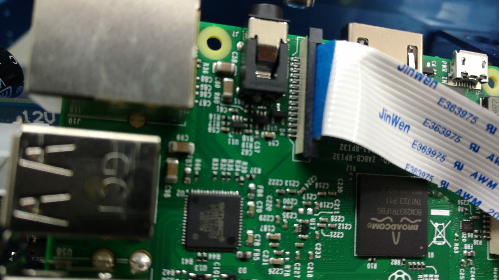
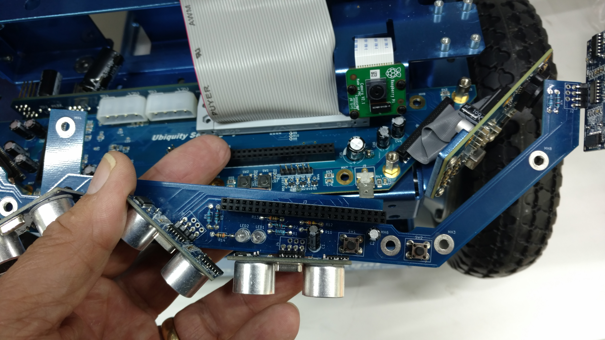

 # Camera and Sensor Installation

Depending on your version of Magni, you may have a different suite of sensors.Silver and Gold versions come with a Raspicam. the Raspicam is needed for fiducial follow, partybot and waypoint navigation. The Silver version comes with a sonar short
range obstacle avoidance system, and the Gold version includes both the sonar and an IR long range obtacle avoidance package.

 ## Camera Installation

The easiest way to install the camera is to remove the the Pi, attach the camera to the mounting bracket, and thread the cable through the slot holding the camera.

Then attach the cable to the Pi, the 'blue' part of the cable faces toward the USB ports.

 

 Then reinstall the Pi, making sure the pins are aligned correctly. (Mis-aligned pins will cause the Pi to fail!)

 ## GOLD IR Long Range Sensors
 
To begin the sensor package installation, insert one end of the 50 pin ribbon cable into the Main controller board, the socket is above the Raspberry Pi. The next steps concern the Gold version IR sensor package.  If you do not have this sensor, skip these steps and continue to sonar sensors.

Insert the ribbon cable on both the left and right IR cameras.

The cameras are installed with three M4 bolts.

Next, attach the circuit board for the IR cameras with 4 standoffs.

The cables from the camera/IR LED wings are atached to the circuit board.

 ## Sonar Sensors (SILVER)

The sonar sensors do not require the IR pakage to work, simply install the 4 standoffs without the IR circuit board.

The Sonar package is attached to the standoffs with 4 M2 Allen head screws.

Last step is attache the 50 pin ribbon cable.

Lastly attach the cover plate with 6 M4 screws.  You are done, hooray!

Note: on testing the camera.  If you find that fiducial follow or waypoint navigation aren't working, you need a quick way to test the camera.  if you can open a ssh session to the robot, try the following command:

raspistill -o test.jpg

If you don't get an error message, you have a good camera. An (mmal) error message indicates the camera is not being detected by the Raspberry Pi, this is usually due to a poor cable connection or less likely a bad camera. 
