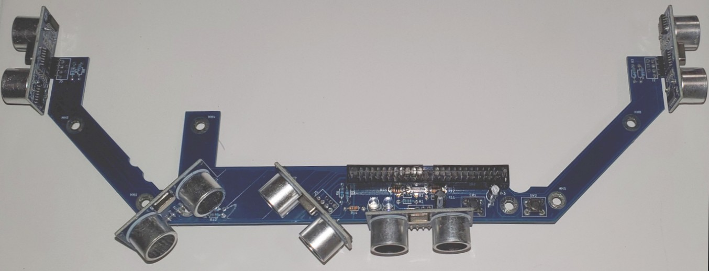

# Camera and Sensor Installation

There are two versions of Magni. The Silver version
comes with a sonar short range obstacle avoidance system, and the Gold
version (not yet available) adds an IR long range obstacle avoidance
package. Both versions come with a Raspberry Pi Camera. The camera is
needed for fiducial follow, partybot and waypoint navigation, and other apps you may write.

## Sonar Board Cable And Camera Assembled
The picture below shows the Raspberry Pi camera in the **forward** orientation
and the cable to the Sonar board included with Magni Silver. This is a very
popular configuration for Magni.

## Camera Installation

Camera Installation
The Raspberry Pi camera can be mounted and configured to work in different
orientations. From the start of the Magni robot there have been 2 popular
orientations. The **forward** camera mounting points forward but also tilts
up about 20 degrees. This enables Magni to view things in front
such as fiducials in the Fiducial Follow application. When the robot is to be
navigating in a space with fiducial patterns on the ceiling the **upward** mounting is used.

POWER MUST BE COMPLETELY OFF FOR THE CAMERA INSTALLATION

Notice that in both orientations that the cable was routed through the slots in
the metal bracket. The camera is screwed to fixed standoffs using M2 screws
3 or 4mm in length. The white side of the flat cable is towards the top of the
board and below there is a blue piece of tape on the cable. The cable must be
inserted as shown in order to properly connect the camera.

The Magni software must be configured to set usage of any camera mounting other than the **forward** configuration. If
you for example use the **upward** facing camera you must before edit the
`/etc/ubiquity/robot.yaml` file as root user to have a line for the raspicam
orientation. The line would be as shown below and a reboot of the robot
is required.

`raspicam:{'position':'upward'}`

Take care when removing the pi to gently rock it back and forth after
unscrewing it&#39;s screw that goes into a standoff on the main board. BE CAREFUL
TO AVOID application of ANY PRESSURE to the very thin Micro SD card inserted
in the right side of the Pi because it sticks out. It is very easy to break the SD
card in this process if your fingers push on the SD card.

Next attach the cable to the Pi; the ‘blue’ part of the cable faces toward the USB
ports.

Next reinstall the Pi, making sure the pins are aligned correctly as in the picture
below. (Misaligned pins will cause permanent failure!)

## Sonar Board Assembly
Below is a picture showing the Raspberry Pi camera in the **forward** orientation
and the cable to the Sonar board included with Magni Silver. This is a very
popular configuration for Magni.

The Sonar board is mounted to the chassis using 4 standoffs that screw into 4
fixed 3mm standoffs on the chassis. This description will show the 2 standoffs
on the right but two other standoffs on the left also at the 45 degree angle are
used as well. The standoffs and the M3 screws are shown below for reference.

The standoffs screw into the fixed nuts on the chassis. Here we show the 2 on
the right.

Below is shown the right side of the sonar board fully mounted using the M3
standoffs and M3 screws from the top.

The ribbon cable is then inserted into the main Magni board as shown in the
picture below where it will be plugged into the Sonar board as the final step.

Lastly attach the cover plate with 6 M6 screws using an M4 Allen wrench. You are
done, hooray!
## Testing the camera.
If you find that fiducial follow or waypoint
navigation aren’t working, you need a quick way to test the camera. If you can
open an ssh session to the robot, try the following command:

`raspistill -o test.jpg`

If you don’t get an error message, you have a good camera. An (mmal) error
message indicates the camera is not being detected by the Raspberry Pi, this is
usually due to a poor cable connection or less likely a bad camera.
