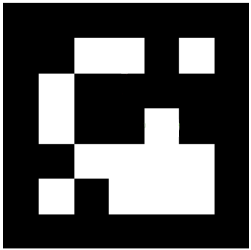

# Fiducial Follow

## Introduction

The Fiducial Follow system enables the robot to follow fiducial markers like this one:

This is an aruco marker. Its a little square image,
that like a QR code contains an identifier encoded in the pattern of the marker. We use this type of marker a lot on our robots and you'll encounter them again when you get to the navigation system description. With fiducial follow running the robot continuously searches its field of view for a specific aruco marker (number 49 by default). Because the marker is a pre-set size and has a pre-set orientation the robot can figure out how far away it is and even which direction it is pointing!

With fiducial follow running the robot knows how far away the marker is so as it moves away the robot will try to follow it. If it moves to the left the robot will turn to the left if it moves to the right the robot will turn to the right. In general the robot will try to maintain approximately the same distance from the marker at all times and will try to keep it in the same orientation. What this means is that you can get the robot to move just by placing a marker in front of the robot. In fact by placing a marker in front of the robot you are telling the robot to move to a location behind the marker as quickly as possible, the robot can move forward **and** back this way.

**Warning:** Magni is a big powerful robot, be really careful about putting a marker in front of the robot. With fiducial follow running you should:
  - Close / hide images of the 49 marker that may be on your computer screen, or on random pieces of paper lying around
  - Avoid trying this in a space with other people or with breakable items until you understand the behavior well
  - Not wave a marker at Magni from a long way away - start about 1.2 meters away
  - Keep the fiducial out of reach of children
If you are not careful Magni can and will move suddenly and you may drive the robot in to something that you wish you had not. Take care; we want you to have fun*

##  To make fiducial follow work:

  Read the above warning and then download and print the following marker:

[Marker 49](49.pdf)

A paper marker works just fine, but for best results the marker should be kept square and perfectly flat. You can do this by mounting the marker on stiff cardboard or anything flat. We always mount our fiducials on foam core. Its available at most print shops.

Put the fiducial away and close all windows on your computer that have a fiducial on them before you do the next step.

Log in to the robot as per the instructions in the section on [connecting](connecting).

Once you are logged in to the robot type the following command:

`Sudo systemctl stop magni-base`

This stops the robot processes that you may be running on the robot that you don't need. Then type:

`roslaunch magni_demos fiducial_follow.launch`

This starts the processes that you need to make fiducial follow work.

Then you can take the fiducial that you printed and put it in front of the robot. Usually the robot will move as soon as it detects an image of the fiducial. The robot can move back and forward. As you move the fiducial around the robot should follow you.

If you move too fast or for some reason the robot loses sight of the fiducial it will attempt to find the fiducial again. It will rotate around the room in an attempt to locate the position of the fiducial until it finally stops.
