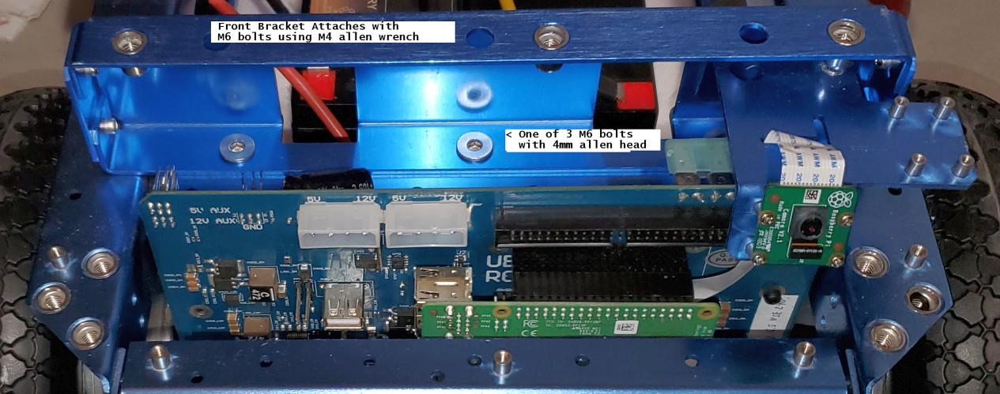
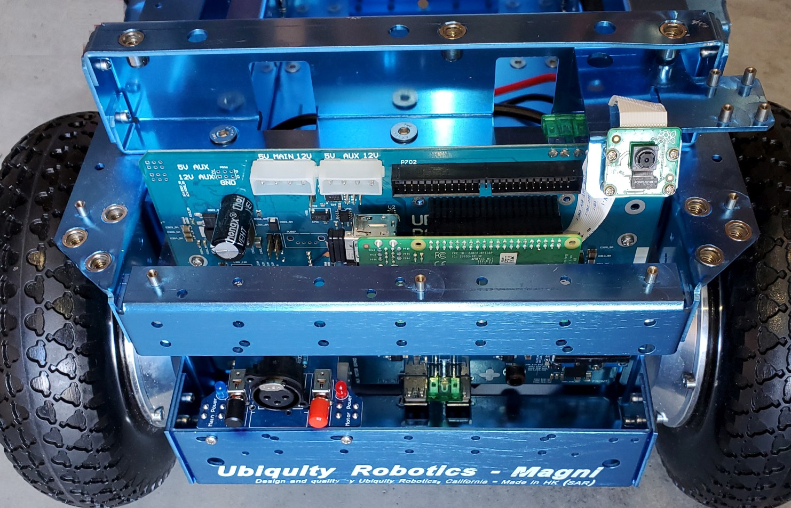
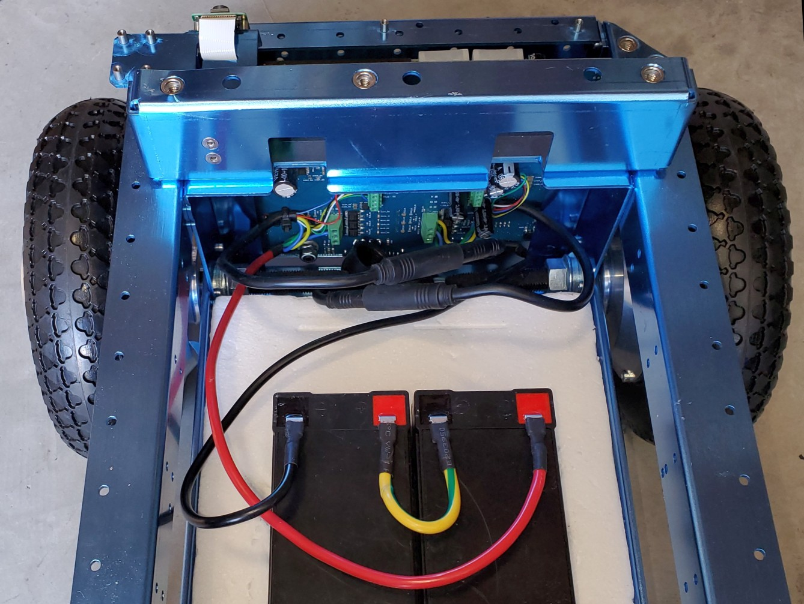

#### &uarr;[top](https://ubiquityrobotics.github.io/learn/) - - - &uarr;[up](ix_quick_start)

## Unboxing and Assembling a Magni Robot

This page directly applies to the most popular of the Magni units, the Silver
version. Two additional versions are the simpler Bronze version which to which this page also applies
and the planned Gold version.

The Magni comes almost ready to run. Two 12v SLA (Sealed Lead Acid) batteries should be purchased separately. **A CR2032 coin cell battery is required for proper operation** and must be installed on the back of the main controller board which will be shown below.

A 4mm Allen wrench (for M6 screws) is included in the shipping box. In addition a small Phillips (cross point) screw driver may be needed for mounting the Raspberry Pi camera.

#### Opening The Box And Inspecting The Contents

#### Step 1 - open the box

 Inside the box you will find the battery cables, brackets for the cover plate, fasteners, and a cover plate.

 **IMPORTANT! DO NOT DAMAGE THE THICK STYROFOAM THAT IS IN THE
 BOTTOM OF THE CHASSIS, THIS IS LATER USED TO HOLD THE BATTERIES**

 

 After removing the robot, note the cover plate which is stored at the bottom of the shipping box.

 

 The Raspberry Pi 3 + SD image card can be installed if you have your own image with your own software (Silver and Gold). However a default image may already have been installed in the factory.
 

  In the small parts bags, you will find fastners and  M4 and M2 Allen wrenches that fit them. The additional sensors (Silver and Gold versions) are wrapped separately.

<!--
 

 The front and back brackets can be installed using the brackets require a M4 hex Allen wrench. We suggest an extra long (6 cm). The other included fasteners are M3 (M2 hex wrench) and a small Phillips screwdriver for Raspi Cam attachment. [See the detailed section on camera and sensor installation.](camera_sensors)
-->

#### Bracket Installation

The picture above shows a Magni as shipped without the 2 brackets. Take time to ensure that the two Motors are connected, which should have been done at the factory. If they are detached, there are arrows on the connectors that (-> <-) show the alignment.
These connectors are sometimes hard to insert
and separate, because it’s hard to grip them.
Each motor attaches to the black
motor cable that comes from the nearest side of the main PC board to that motor.

The picture above shows a Magni without the front bracket.  In this picture the Raspberry Pi camera cable is attached to the Raspberry Pi itself which is part of setup for the camera.   Decide which camera configuration you will want on your Magni.    You should now take a detour to look at [**THIS_PAGE**](https://learn.ubiquityrobotics.com/camera_sensors)  and decide how you want to mount the camera.    Once you decide, use the camera setup page in combination with looking at the pictures on this page about bracket mounting.

Front Bracket

Note that the front and back brackets are different.  The front bracket is the one with a shelf for mounting the Raspberry Pi camera. Using 3 of the M6 flat head hex drive screws attach the bracket.  The Allen wrench will go through the top side of the bracket to reach the screw.    In this case the forward mounted camera was selected and the ribbon cable routed to the camera.  Again, see the camera setup page.

Back Bracket Viewed From Behind

The back bracket attachment also uses 3 M6 flat head hex drive screws. Here we see the 3 screws securing the back bracket to the main chassis.

#### The Mostly Assembled Magni Prior To Battery Install

The Front Bracket with Camera mounted is shown above. The system power switch is the black switch above the first “U” in Ubiquity, and the red switch for the power to the wheels is above the “y". The charging port is between the two switches.  The ON position is with the switch extended out. <!---Both buttons should be lit.-->

**The next step will be to install the batteries.   At this time push both of the switches IN which will turn all power off as you connect the batteries.**

Do not operate the robot when the power to the wheels is off and power to the Raspberry Pi is on  (black switch out and red switch in). On early units commands will be stored by the robot. Then when power is enabled, the robot may move unexpectedly.

#### Main Power Battery Installation

Use the thick styrofoam cutout piece that came with your Magni in the bed of the chassis. It holds the most common battery types in place even if the robot bumps things or is moved around.  

The picture above shows proper cable connections for the batteries.  The red power cable goes to positive of battery on the right.  The yellow cable connects the positive of the left battery to the negative of the battery shown on the right. The black cable goes from the negative terminal of the battery on the left to ground on the robot.

There are cables for both spade type and screw type battery terminals. A 24 volt battery charger is included in the package (Photo not available). The recommended batteries are of the type specified by UB12xxx where xxx specifies Amp Hours. Commonly UB1250, UB1290, or UB12150 are used. Since it is unknown what size and shape the batteries will be it is the user’s responsibility to see they are secured in the chassis by the use of straps or packing material.

<!-- *{TODO: Somewhere there needs to be a discussion of what size batteries to use.  The spade connector sizes need
to be specified.  The user should be prepared for a current inrush spark? (not sure that this still occurs on initial battery insertion)  Is there a strap to hold the batteries down?  How is it installed? }*

-->
#### The Real-Time Clock battery
There is also a CR2032 coin cell battery on the back of the circuit board.  This provides power to the real-time clock, which is **essential**.  If this battery is not installed, obtain one and install it. Insert the battery with the lettering side up.

<!---->

#### Optional Top Flat Plate Install

The top plate should be the last thing attached, using 6  M6 machine screws.   Note that the countersunk holes will be on the top and that an extra hole that is meant for an upward facing Raspberry Pi camera should be over the camera bracket.

A video of the unboxing process is available:  [Video](https://youtu.be/pF38kFOl0Ic)

<<[back](ix_quick_start)- - - - - - - - - - [next](logitech)>>
