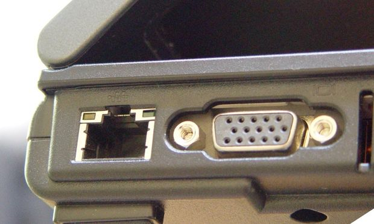

# Site Survey

A site survey is required for each location where you intend to run your robot.
The site survey determines the site computational assets (i.e. laptops, desktops, etc.),
the network environment (i.e. Wifi, access points, cables, etc.), and a few miscellaneous
other issues.  The site survey is organized as simple text file that is printed out
and filled in.  Print out one survey form for each robot site and fill it in.  This
document will walk you through filling in the form.

Start by visiting the
[Site Survey Form](site_survey_form/site_survey_form.md)
and printing out one form for each site you intend to survey.

## Heading

Start by writing the site name/location, date, and your name on the heading of the form.

    Site Name: _________________________________  Date:_____________  Surveyor:_________

That was easy.

## Computational Assets

In order to develop code and run robot applications, your computer(s) must have
ROS (Robot Operating System) running on it.  Since ROS only runs on a 64-bit
Linux Ubuntu operating system, it will be necessary to get this version of Linux
running on your platform. If you already have a dedicated laptop, you are set, if not
the strategies for running 64-bit Ubuntu Linux are:

* Replace Current OS with Linux:
  You can simply replace Windows/MacOS/FreeBSD with Ubuntu Linux.  This is a pretty
  this is the easiest way to proceed, but will make it impossible to use the laptop for 
  other purposes.

* Partition your disk to support multiple operating systems.  This is less extreme
  and is still pretty challenging.  If you go down this route you are on your own, 
  if one partition fails, it is almost impossible to recver the entire system.

* Run virtualization software on your native operating system.  We recommend
  the virtualization strategy if you need to use the laptop for other purposes.

There are a significant number of virtualization vendors.  We provide a prebuilt
virtual image that contains Ubuntu Linux 14.04, ROS, and all the Ubiquity Robotics
software preinstalled.  This virtual image is in 
[Open Virtualization Format](https://en.wikipedia.org/wiki/Open_Virtualization_Format),
specifically it is a
[Open Virtual Appliance](https://en.wikipedia.org/wiki/Virtual_appliance)
file (i.e. an `.ova` file.)  There are approximately 10 vendors that support `.ova`
file format.  Of these virutalization vendors, we use
[Oracle VirtualBox](https://en.wikipedia.org/wiki/VirtualBox)
because it is well supported and freely available.
You are welcome to use an alternative virtualization vendor, but you will be on
your own, since we can only provide support for the vendor that we actually use
(i.e. VirtualBox.)

We partition computation assets into desktops and laptops.  At some sites you
will choose to use both a laptop and a desktop.  We only walk through the laptop
forms since they desktop form is a proper subset of the laptop form:

      [ ] Laptop:
          Operating System:
             [ ] Windows Version: [ ] 10, [ ] 8, [ ] 7, [ ] Windows Other
             [ ] MacOS Version: [ ] High Sierra, [ ] Sierra, [ ] El Capitan, [ ] Other
             [ ] Linux Distro: [ ] Ubuntu, [ ] Fedora, [ ] Other
                 Ubuntu Version: [ ] 16.04, [ ] 16.10, [ ] 17.04, [ ] 17.10, [ ] Other
          Processor: [ ] 64-bit x86, [ ] 32-bit x86, [ ] PowerPC, [ ] ARM, [ ] Other
          Virtualization Software Installed: [ ] None, [ ] VirtualBox, [ ] Other
	  Available Disk Space: ___ GB
          RJ45 Ethernet Connector: [ ] Yes, [ ] No

Please perform the following steps:

1. Check off:

      [X] Laptop:

   if you are going to use a laptop at the site.

2. Determine which operating system version you running.

          Operating System:
             [ ] Windows Version: [ ] 10, [ ] 8, [ ] 7, [ ] Windows Other
             [ ] MacOS Version: [ ] High Sierra, [ ] Sierra, [ ] El Capitan, [ ] Other
             [ ] Linux Distro: [ ] Ubuntu, [ ] Fedora, [ ] Other
                 Ubuntu Version: [ ] 16.04, [ ] 16.10, [ ] 17.04, [ ] 17.10, [ ] Other

   Depending upon your operating system you are running the version can be found as follows:

   * Windows:

     *{ waynegramlich: Not a clue *}

   * MacOS:

     *{ waynegramlich: Not a clue *}

   * Linux:

     Run the following command from a shell:

         lsb_release -d -s

     and you will get something that looks like:

         Ubuntu 16.04.2 LTS

     In this instance you would check off:

         [X] Linux Distro: [X] Ubuntu, [ ] Fedora, [ ] Other
 	     Ubuntu Version: [X] 16.04, [ ] 16.10, [ ] 17.04, [ ] 17.10, [ ] Other

     Just for your information, `LTS` stands for Long Term Support.

3. Depending upon which operating system you are running, processor architecture
   is determined as follows:

   * Windows:

     *{ waynegramlich: Not a clue *}

   * MacOS:

     *{ waynegramlich: Not a clue *}

   * Linux:

     Run the following command from a shell:

         uname -p

     and you will get something that looks like:

         x86_64

     In this instance you would check off:

         [X] Linux Distro: [X] Ubuntu, [ ] Fedora, [ ] Other
             Processor: [ ] 64-bit x86, [ ] 32-bit x86, [ ] PowerPC, [ ] ARM, [ ] Other

         Processor: [X] 64-bit x86, [ ] 32-bit x86, [ ] PowerPC, [ ] ARM, [ ] Other

   Please note that ROS only runs on 64-bit x86 at this point in time.  If you do
   not have a 64 bit x86 processor architecture you can stop now.

4. If you have previously installed some virtualization software on your operating
   system, please check off the appropriate box below:

        Virtualization Software Installed: [ ] None, [ ] VirtualBox, [ ] Other

   If you do not know if any virtualization software is installed,
   please check off `[X] None`.

5. Now determine how much available disk space you have:

        Available Disk Space: ___ GB

   Depending upon your operating system, you can determine the available disk space
   as follows:

   * Windows:

     *{ waynegramlich: not a clue}*

   * MacOS:

     *{ waynegramlich: not a clue}*

   * Linux:

     Run the following command from a shell:

         df -kh .

     and you will get something that looks as follows:

         Filesystem      Size  Used Avail Use% Mounted on
         /dev/nvme0n1p2  465G  271G  171G  62% /

     The number you want is under `Avail` and in this particular case is `171GB`.

6. Look around the edges of you laptop to see if you have an RJ45 Ethernet connector.
   In the image below, the connector on the left is an RJ45 Ethernet connector:

   

   If you see such a connector, please check off `[X] Yes` as follows:

       RJ45 Ethernet Connector: [X] Yes, [ ] No

If there is a desktop machine at the site, please do a similar set of steps.

## Raspberry Pi:

Currently, all Ubiquity Robotics platforms use Raspberry Pi 3 processor to
run ROS and control the robot.  The next section looks as shown below:

    Raspberry Pi:
      [ ] Raspberry Pi: [ ] Raspberry Pi3, [ ] Other, [ ] None
      [ ] Raspberry Pi Camera: [ ] Version 1, [ ] Version 2, [ ] 3rd Party
      [ ] MicroSD Card: [ ] <8GB, [ ] 8GB, [ ] 16 GB, [ ] 32GB, [ ] >32GB
          MicroSD Card Speed: [ ] class 10, [ ] UHS 1, [ ] UHS 2, [ ] UHS 3
      [ ] HDMI display: [ ] Plugged into desktop, [ ] Unused [ ] Unavailable
      [ ] USB Keyboard: [ ] Plugged into desktop, [ ] Unused [ ] Unavailable
      [ ] USB Mouse:    [ ] Plugged into desktop, [ ] Unused [ ] Unavailable
      [ ] USB to MicroSD Adapter

and identifies information your Raspberry Pi (if you have one.)

Please follow the following steps:

1. Determine which Raspberry Pi you have (if any):
   If you do not have a Raspberry Pi, you should check off `[X] None`.

   If you have a Raspberry Pi, compare it to the image immediately below:

   

   If your Raspberry Pi does not look exactly like the image above, please check
   off `[X] Other`; other checkoff as follows:

       [X] Raspberry Pi: [ ] Raspberry Pi3, [ ] Other, [ ] None

2. Camera:
   The Raspberry Pi camera comes in two versions.  We support the both versions.

       [ ] Raspberry Pi Camera: [ ] Version 1, [ ] Version 2, [ ] 3rd Party

   *{ waynegramlich: Do we actually support both versions? }*

   An image of the Raspberry Pi Camera Version 2 is shown immediately below:

   

   If your camera looks like the image above, check off as follows:

       [X] Raspberry Pi Camera: [ ] Version 1, [X] Version 2, [ ] 3rd Party

   If you do not have a Raspberry Pi Camera, we really recommend that you purchase one.

3. The Raspberry Pi 3 operating system and ROS run off of a MicroSD card plugged
   into the Raspberry Pi 3.  We recommend that you have a microSD card that has
   a speed of at least speed class of 10 or greater.  The
   [SD Association](https://www.sdcard.org/)
   has a page that describes
   [speed classes](https://www.sdcard.org/developers/overview/speed_class/).

       [ ] MicroSD Card: [ ] <8GB, [ ] 8GB, [ ] 16 GB, [ ] 32GB, [ ] >32GB
           MicroSD Card Speed: [ ] class 10, [ ] UHS 1, [ ] UHS 2, [ ] UHS 3

   Only check this item off if you actually have a microSD card.  We need
   a microSD card that is at least 8GB in size.  However, we recommend 16GB
   just to be sure.

4. The next section concerns whether or not you have access to an HDMI display,
   USB keyboard and USB Mouse.  It turns out that the Raspberry Pi 3 is fully
   capable of running as a stand alone computer with a graphical desk top.
   This can only be done if you have all three of these devices are available.
   The three lines from the survey are shown immediately below:

       [ ] HDMI display: [ ] Plugged into desktop, [ ] Unused [ ] Unavailable
       [ ] USB Keyboard: [ ] Plugged into desktop, [ ] Unused [ ] Unavailable
       [ ] USB Mouse:    [ ] Plugged into desktop, [ ] Unused [ ] Unavailable

   Only select `[X] Plugged into desktop`, if the device exists but is already
   plugged into the desktop.  In this case, it is possible to temporarily
   power down the desktop and "borrow" the display/keyboard/mouse.  Select
   `[X] Unused` if the display/keyboard/mouse is available and not plugged
   into anything.  Lastly, select `[ ] Unavailable` if the device is not
   present at the site.

5. The last issue concerns whether the site has a USB to MicroSD adapter.
   This adapter is used to download a preconfigured Ubuntu Linux for the
   Raspberry Pi down to the micorSD card.  Alas, this task is tricky because
   not all USB to microSD card adapters work with all virtualization vendor
   software.

      [ ] USB to MicroSD Adapter

   Please check `[X] USB to MicroSD Adapter` if you have such an adapter.
   You will not know if you have adapter that works with your virtualization
   vendor software until you try it out.

## Networking

Networking is actually quite a complicated subject.  When you are developing
ROS based software for your robot, it necessary to have a wireless connection
between you robot and the laptop/desktop that you develop software on.  The
relevant portion of the survey is shown below:

    Networking:
      [ ] WiFi Available:
          Bands: [ ] Single Band, [ ] Dual Band, [ ] Unknown
          Access Control: [ ] WPA2 PSK, [ ] WPA2 Enterprise, [ ] Open Access, [ ] Other
      [ ] Wired Network Available: [ ] Empty Available RJ45, [ ] Temporarily Available
          DHCP Support: [ ] Yes, [ ] No
      [ ] Extra Ethernet Cable

To do this portion of the survey you basically need to have both a laptop *and*
some sort of WiFi access point.  The term "WiFi access point" kind of a generic term.
The less generic terms are "Wifi Router", "WiFi Cable Modem", "WiFi DSL Modem", etc.

Now we can walk you through this portion of the site survey:

1. It is really important to know the SSID (Service Set IDentifier) for the
   WiFi access point.  This is the "name" of the WiFi device.  Each different
   operating system has a different way of showing the list of available SSID's.

   * Windows:
     *{waynegramlich: not a clue }*

   * MacOS:
     *{waynegramlich: not a clue }*

   * Linux:
     For Linux, we can see what WiFi access points are available using a program
     called `nmcli` (Network Manager Command Line Interface).  Please run

         nmcli -c no -t -f ssid dev wifi

     and it show something like:

         yrlus4G
         yrlus24
         --
         --
         peekaboo
         NETGEAR31
         vinos

     These are the list of available SSID's.  You need to identify the SSID that
     you intend to use to connect to the network.

