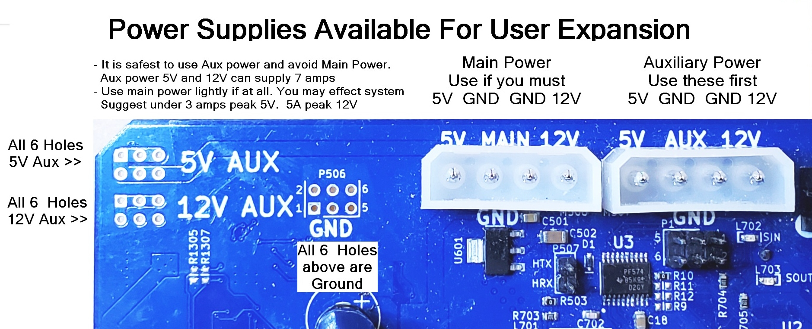
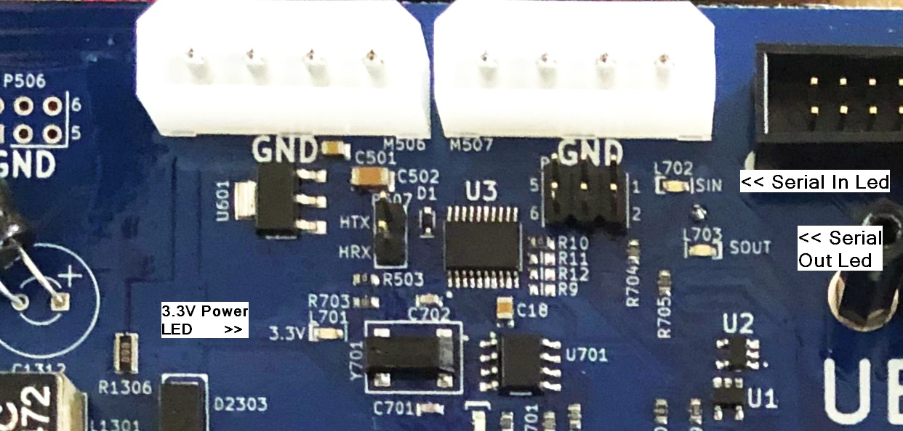

#### &uarr;[top](https://ubiquityrobotics.github.io/learn/)

# Master Control Board Connectors and User Power Supplies

This page tells explains the connections that the MCB, Master Control Board, make available as well as the LED indications on the board.

The Master Control Board is sometimes called ```Motor Control Board``` or ```MCB```.

This page highlights the power supplies available for user use and briefly explains the LEDs on the board.  More details on the LEDs is available elsewhere but it was felt a brief overview here combined with the main connections a user may want to use would be nice to have on one page.

## A Comprehensive Description Of MCB Connections

We have always had a separate document showing most all of the MCB connections.
To see this comprehensive document please see [Motor Controller Board Pinouts And Power Supply Ratings](https://learn.ubiquityrobotics.com/Magni_MCB_pinout.pdf)

This page is meant to highlight more common connectors being asked about but the earlier full list of the  MCB connections still exists in above link.

## Power Supplies Available For User Specific Equipment

The picture below shows the 4 power supplies available in cases where a user may need 12V or 5V for their own circuits.
We prefer that the user use the  Auxilary 12V and 5V power first because they are separate from the robot main supplies.
The auxilary supplies should be able to supply 12V at 7 amps and 5V at 7 amps.  High transient loads may cause them to briefly sag.



## The USB Style 5V Power, Fan Power, High Current Aux Power And Main Battery fuse

Located at the bottom of the MCB board there are two 5V connectors that you may plug in a standard USB A cable to get 5V.

Starting with MCB rev 5.2 we have added a standard 3-pin 12V Fan Power Jack where G is ground and + is 12V.

The Aux Motor Board jack allows for high current full unregulated battery voltage usage.  We recommend you contact us if you wish to use this jack.  The jack was put on this board for an expansion jack for internal use but is available.  See the P*1001 jack description in the comprehensive description of MCB connections doc we gave a link for a couple paragraphs ago for more detail.

Also shown in this picture is our main battery fuse which we hope you never have to worry about but it is just above the USB power jacks


# Master Control Board Led Indicators

Although the LED indicators are discussed in assorted sections of this document a brief listing of them here was felt to be of value as a summary.

## Power Supply And MCB Status LED

A row of 5 leds can be seen to the lower left as you look at the MCB board.   In boards prior to rev 5.0 they were vertical but as of rev 5.0 and later they have been horizontal.    Here is a table showing the meaning of these leds from left to right.

The 4 power supply leds should always be on when power is active.  The 12V Main and 5V Main are critical for robot operation. Auxilary supplies are for user only.

|  Led Name | Description |
|-------------------------|----------------------|
|  12VA |  Lights when the 12V Auxilary supply is active |
|  12VM  |  Lights when the 12V Main supply is active|
|  5VM |  Lights when the 5V Main supply is active |
|  5VA |  Lights when the 5V Auxilary supply is active |
|  STAT | Shows status for the MCB onboard processor |

The STAT led is more recently labeled STATUS and is highlighted and is the most complex led.
Normally it is on with very brief drop-outs every 4 to 6 seconds.   The exact period of the dropouts indicates firmware version and is explained on firmware version page.
As of firmware v37 we have had a self test and battery monitoring function where the STATUS led if it shows odd blink patterns is indicating some form of warning or battery low indication.  See the 'Verification' page for details on the blink codes.

## The Main Power and Motor Power Active Leds

Starting with MCB version 5.0 there exists leds on the MCB board to indicates when either or both of the two main power feeds is active on the MCB.

When the main power is active there is an led on the far left and lower part of the board  that will be on.  This indicates the main power is active and the board is powered up.  If this is on but the black power button is off there may be a problem with our ECB, Electronic Circuit Breaker circuit.

When main power is active AND the red 'ESTOP switch is also in the out position the motor power led located on the far right and very low on the MCB will be on.  If this LED is stuck on and does not turn off it indicates a problem with the Motor power ECB, Electronic Circuit Breaker circuit.

## The 3.3V Onboard Power Regulator

Starting with MCB version 5.2 we have an onboard 3.3V power regulator so that the 3.3V circuits do not have to use the 3.3V power from the Raspberry Pi.  This is both a reliability enhancement as well as a way to have more 3.3V power even when a user uses a different CPU than the Raspberry Pi.

There is an led that should be on whenever the board is powered up and that led is labeled 3.3V and is located about 2cm lower than the large white Main Power jack at the top of the board.



## The Serial Communication indicators

Starting with version 5.2 of the MCB board we added two leds that normally blink very fast once the system has come up and is running.

These two leds are labeled ```SIN``` and ```SOUT``` and are located just below the right large white AUX power connector at the very top of the board near the center.

Normally the SOUT led will blink very fast right after power up of the robot.  The SIN led will take a minute or more to blink because the Raspberry Pi has to initialize the Linux operating system before it gets to starting to communicate with the MCB.    Unfortunately the led is a bit hard to see but be aware that until this SIN led starts to blink very fast the robot will not respond to any sort of command.   So the leds is valuable to tell when the robot is ready to go.
