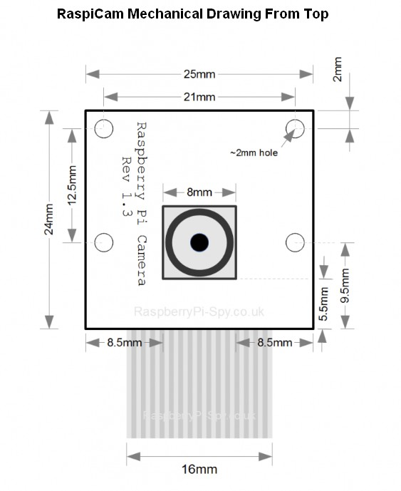

#### &uarr;[top]( https://ubiquityrobotics.github.io/learn/)

## Mechanical Drawings
Here are some mechanical drawings that are of use for persons who want to add to the Magni robot base as they form their own unique product or project.

### Top Plate

The top plate of the magni is a very thick plate that firmly attaches to the base using 4 beveled head screws in order to provide a flat, sturdy top plate for mounting of devices of your choosing.

Here is a drawing that shows the dimensions used for the plate as well as some basic Magni specifications so you know the height of the plate and it's position relative to the wheels on the robot.

You may also want to view [the full PDF document](Ubiquity_Robotics-Magni-Mechanical-TopPlateAndWheels.PDF)

### The MCB Board Blank Holes

Some users wish to mount the MCB board in their own robots.  Here are a few drawings that show the boardblank size and some key mounting holes.  

Here is a more detailed view of [the MCB board blank](Mcb_5p2_MountingHoles.pdf)

### RaspiCam Mounting holes

We by default supply the RaspiCam V2.1 camera with our Magni Silver product package.  This board is from the Raspberry Pi Foundation and is extremely popular because of its high resolution combined with small form factor.

If you want to mount the camera somewhere else this drawing may be of use.

### OLED Display For Use With MCB Boards

Starting with rev 5.2 mcb boards we have been supporting a small OLED display for showing some key status of the Magni product.    Because not all units have the OLED board yet we are below supplying the mechanical specs.   This is very important because these displays have very slightly different mounting and even pinouts sometimes.  A common version that works electrically but has tiny M2 hole sizes is very common for example.  Pay close attention to order of signals on the pins as well s the precise hole size and spacings.

